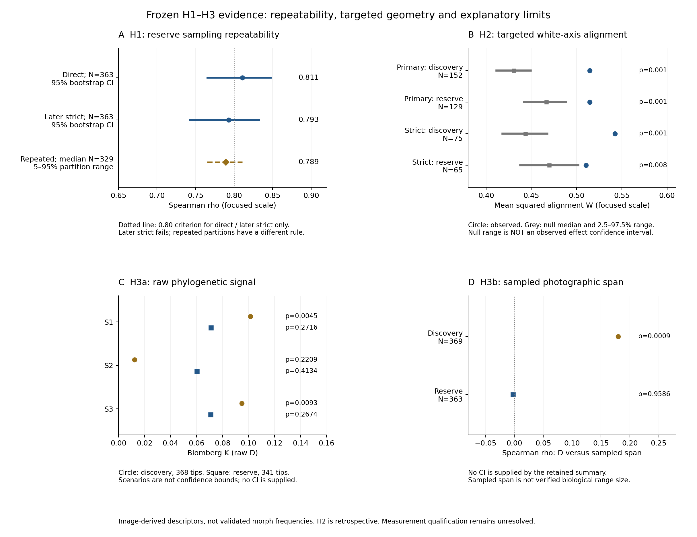

# Observer-disjoint reproducibility and white–nonwhite geometry of photo-derived flower-colour diversity

Working manuscript — incomplete, not submission-ready. Numerical evidence is
frozen; references, figures and measurement qualification remain outstanding.
The companion is [Supplement](FCP_H123_SUPPLEMENT.md). This is the active H1–H3
draft; older RGFCA and literature-comparison manuscripts are historical records.

## Abstract draft

Repeated photographs may characterize within-species colour diversity, but
sampling reproducibility must be distinguished from biological measurement
accuracy. We evaluated a four-state diversity score in species-disjoint,
high-depth discovery and reserve cohorts, examined recurrent directions of
within-species palette variation, and tested bounded phylogenetic and geographic
associations. In the 363-species reserve, a frozen observer-disjoint analysis
recovered species rankings with Spearman rho 0.811 (bootstrap 95% interval
0.765–0.847). Existing-cohort targeted analyses supported a white–nonwhite
direction beyond a coarse-state-preserving null, including the strict reserve
analysis (p=0.008). This particular direction was identified after inspection
of broader geometry, so it is not an untouched prospective confirmation.
Broad phylogenetic signal and the discovery association with sampled geographic
span were not supported in reserve. These findings support reproducibility and
constrained geometry of the current image-derived measurements; unresolved
localization and highlight confounding prevent treating them as validated
biological morph frequencies or identified ecological mechanisms.
The completed 110-image Monarda localization diagnostic failed its fixed
operational gate; this is a measurement limitation, not a biological absence.

## Introduction

The manuscript separates three questions: whether species-level photographic
colour diversity is reproducible across observers (H1), whether within-species
palette variation shares a recurrent direction (H2), and whether broad
phylogenetic structure or sampled geographic span is associated with measured diversity
(H3).

Citizen-science photographs can provide useful visible-colour information, but
their accuracy depends on the measurement target and photographic conditions.
Laitly et al. (2021) compared photographic and controlled measurements and found
that aggregation could improve agreement; this does not establish a universal
sampling threshold for within-species diversity. Luong et al. (2023) demonstrated
landscape-scale flower-colour analysis using manually selected Erysimum petal
pixels, with a separate colour-correction assessment. These precedents establish
feasibility, not the accuracy of our automated multi-species estimator.

The distinction matters because calibrated reflectance measurement requires
additional acquisition information, including linearized image measurements and
reference standards (Troscianko & Stevens, 2015). A reproducible descriptor from
ordinary photographs need not be calibrated reflectance or a pollinator's colour
signal. We therefore evaluate sampling reproducibility and observed palette
geometry separately from their possible biological interpretation.

## Methods — evidence-backed outline

The global frame contains 42,111 species, but the high-depth discovery (369
species) and reserve (363 species) are eligibility-selected validation cohorts,
not a representative global sample. They must not be used to estimate worldwide
polymorphism prevalence. The 34-species literature comparison and six-species
spatial study are not analyses or supporting evidence in this manuscript.

H1 uses D = 1 - sum(p_k squared) for white, yellow/orange, red/pink and
blue/purple image states; mixed/uncertain is excluded from those four states.
The direct analysis groups classifiable rows into indivisible observer blocks
within each species. Blocks are sorted by decreasing row count with SHA256
tie-breaking, then assigned to balance half counts. Blank observer identifiers
are not assigned. Before opening state labels for this test, the frozen
opportunity rule selects the largest of 20, 15 or 10 classifiable observations
per half that retains at least 100 species in both cohorts; it selected 20.
The preflight uses species, observer identity and an existing classifiability
flag, not state labels, palette values, dates or coordinates. It is not a claim
that the classifiability flag was generated independently of prior imaging.
Reserve decision criteria are rho >=0.80, bootstrap lower bound >0.70 and
permutation p<0.001. Repeated-partition and
later strict-split results are reported separately, not substituted post hoc.

Spearman rho describes cross-species rank agreement between half-specific D.
The bootstrap samples species pairs with replacement 5,000 times and reports
the 2.5th and 97.5th percentiles of finite correlations. The permutation test
reassigns half-B ranks among species 20,000 times and uses a two-sided plus-one
p-value with denominator 20,001. Lin CCC (Lin, 1989) and absolute half differences describe
value agreement separately from rank agreement (Supplement S1). Neither CCC nor
these diagnostics can rescue failure of the frozen primary criteria.

H2 uses classifiable photographs in the four retained image states. Their nine
palette fractions (white, yellow, orange, red, pink, magenta, purple, blue,
bronze) are normalized to sum to one. Eligible species have at least 40
classifiable photographs, a second-most-common coarse-state fraction at least
0.10, and a minor continuous cluster fraction at least 0.10; the strict analysis
uses 0.20 for both fraction gates. Deterministic two-means is applied to the
square roots of normalized fractions, without coarse-state labels as cluster
inputs. The difference between the two clusters' mean original compositions
defines Delta; nonzero Delta is normalized to a unit axis u. Thus cluster fitting
uses Hellinger coordinates while the reported displacement uses composition
coordinates. Sign is immaterial to the targeted statistic.

The fixed contrast q is the unit-normalized vector [1, -1/8, ..., -1/8], with
the positive coordinate assigned to white. W is the equally species-weighted
mean of (u dot q)^2, not the fraction of photographs classified as white.
Within each cohort and coarse state, normalized palette rows are permuted
across the selected species, preserving each species-by-state row count. Two
clusters and their displacement are refitted for every null world. With 999
worlds, the upper-tail Monte Carlo p-value is (1 + count(null W >= observed W))
/1000. Discovery and reserve are evaluated separately; q is not fitted to either.
The primary decision requires both cohorts to have p<0.05, with the strict
analysis retained as sensitivity evidence (Supplement S2).

The selected observed species set is held fixed in these null worlds: the
continuous minor-cluster admission gate is not reapplied after permutation.
This is the implemented construction null for a selected set, not a complete
replay of selection or an observer-, season- or geography-stratified null.
Its adequacy for stronger biological inference remains unestablished.

H3a uses V.PhyloMaker2 (Jin & Qian, 2022) with the frozen dated backbone
(GBOTB.extended.LCVP) under
S1–S3 placement scenarios. Each scenario retains 368/369 discovery species and
341/363 reserve species, exceeding the pre-outcome requirements of 90% coverage
and 250 tips per cohort. The unmatched species are not assigned zero signal.
Raw D is tested using Blomberg K (Blomberg et al., 2003) with 9,999 randomized trait-to-tip assignments;
tree, branch lengths, retained species and trait values remain fixed. The
upper-tail plus-one p-value has denominator 10,000. Reserve support requires
p<0.05 in all three scenarios. Pagel lambda (Pagel, 1999) and its likelihood-ratio test
against zero are secondary diagnostics and cannot rescue the primary decision.

The H3a opportunity sensitivity regresses centered ranks of D on centered
ranks of log1p(classifiable count), log1p(observer count) and log1p(sampled span),
with an intercept. These residuals are calculated within the eligible cohort
before tree matching and then subjected to the same K randomization. The
finite-sample correction D*n/(n-1) supplies an additional effect-size sensitivity.
The constant total of 100 measured photographs per source species cannot act
as a varying control.

H3b tests sampled photographic span, not true biological range size. Span is
the maximum pairwise haversine distance among finite coordinates in all 100
measured photographs per species, without colour or classifiability filtering
(Earth radius 6371.0088 km). The primary association is Spearman rho between D
and log1p(span), using all 363 eligible reserve species without tree matching.
Its two-sided test permutes D ranks among species 20,000 times, with a plus-one
denominator of 20,001. Support requires positive reserve rho and p<0.05.
Sensitivities use finite-sample-corrected D, partial ranks controlling usable
image and observer counts, and rank-PGLS using phylolm (Ho & Ané, 2014) on the
341 matched reserve tips. This secondary regression fits a lambda covariance
model and uses a normal-reference coefficient test, not the primary
permutation test (Supplement S3). The
partial-rank test permutes residualized D against a fixed residualized span;
it is a sensitivity, not causal adjustment. The reserve is the replication
cohort for both H3 tests; discovery associations were already inspected.
Failed replications are retained without searching for replacement predictors.
The plus-one randomization convention avoids reporting zero Monte Carlo
p-values (Phipson & Smyth, 2010). This correction does not establish the validity
of a null construction or remove selection and dependence concerns.

Measurement qualification was evaluated separately from H1–H3. The estimator
combines retained generic flower masks rather than selecting a verified focal
taxon's petals. The JRC box-based qualification and Monarda polygon-based
diagnostic therefore have different reference targets. For Monarda, all 110
exported images were accounted for: 109 had positive generic flower annotations
and one had unknown reference status. The latter was not treated as a verified
negative. The fixed gate required pooled prediction precision >=0.70, pooled
reference recall >=0.35 and median annotated-image precision >=0.70 jointly.
Precision means overlap with the supplied polygon union, not verified petal
purity. Saved pixel-count arithmetic is reported in Supplement Table S1;
neither model predictions nor annotations were regenerated for this manuscript.

## Results

**Figure 1. Frozen evidence summary.** (A) Reserve H1 rank repeatability:
direct and later strict splits have bootstrap 95% intervals; the repeated-split
row shows the median and 5th–95th percentiles across 200 partitions, not a
confidence interval. The 0.80 line applies to the two deterministic split
criteria only. (B) Observed W and structured-null median/central 95% range;
the latter is a null distribution range, not uncertainty around observed W.
(C) Raw Blomberg K across all three placement scenarios, retaining discovery
and reserve; scenarios are not confidence bounds. (D) D–sampled-span correlation
in each cohort. C–D have no confidence intervals in the retained summary and
none are invented. P-values refer to each panel's original test, not differences
between plotted estimates. H2 is retrospectively targeted, and none of the
panels establishes anatomical measurement validity or a causal mechanism.
[Vector PDF](figures/h123/h123_evidence.pdf) and
[plotted values with source hashes](figures/h123/h123_evidence_data.json).

### H1: repeatability, not proof of biological accuracy

The direct observer-disjoint reserve analysis includes all 363 eligible species:
rho=0.8109164415, bootstrap interval [0.7648383249, 0.8474976907],
permutation p=0.0000499975, and Lin CCC=0.8582944314. All frozen decision
conditions pass. The finite-sample-corrected D gives rho=0.8116141836.

Separately, 200 observer-disjoint partitions yielded median reserve rho=0.789103
and fifth percentile=0.765165. A later strict deterministic split yielded
rho=0.792728 and failed its 0.80 criterion. These results constrain the claim:
repeatability is substantial, but not perfect or invariant to every partition.
The historical approximately 0.971 value is not evidence for current D.

### H2: a narrow, retrospectively targeted pattern

The targeted white–nonwhite test gives W=0.514625 in discovery (152 species)
and W=0.514586 in reserve (129 species), with structured-null p=0.001 in
both. Under the strict threshold, discovery (75 species) gives W=0.542355,
p=0.001; reserve (65 species) gives W=0.510517, p=0.008. After removal of
the white contrast, the residual structured-null analyses do not support a
general recurrent nonwhite hue direction. This is an existing-cohort targeted
result, not prospective confirmation of the specific white axis.
The corresponding primary null medians are 0.430808 and 0.466546; the observed
excesses are 0.083817 and 0.048039, respectively. The structured null already
contains substantial white-axis alignment. The isotropic expectation of 0.125
is therefore not the appropriate baseline for these reported targeted tests.

### H3: bounded explanatory tests do not replicate

Reserve phylogenetic signal is unsupported across S1–S3 (raw Blomberg K
permutation p=0.272, 0.413 and 0.267). The discovery sampled-span association
(rho=0.179879, p=0.000900) does not replicate: reserve rho=-0.002586,
p=0.958602. These tests do not establish that evolutionary history or true
geographic range size is biologically irrelevant.
Opportunity-adjusted reserve K is also unsupported in S1–S3 (p=0.3500, 0.2464,
0.3510). For H3b, finite-sample-corrected D yields reserve rho=-0.002374,
p=0.962902; partial ranks yield rho=0.005519, p=0.916204. Supplement Tables
S3–S4 retain the discovery and reserve comparisons without treating these
sensitivities as separate opportunities to rescue the primary result.

### Measurement qualification: a completed failure, not a pending test

All 110 Monarda images completed without a model runtime failure. Among the 109
annotated images, 15 produced empty predictions and remained in the evaluation.
Pooled prediction precision was 0.56824250 and median image precision was
0.51480059, both below their 0.70 floors; pooled recall was 0.42608787, above
its 0.35 floor. The conjunctive localization gate therefore failed. A passing
runtime or recall component does not reverse the two precision failures.
These comparisons do not identify whether disagreement arose from localization
error, incomplete reference annotations or mismatch in anatomical target.

## Discussion — limits governing interpretation

### What the joint evidence establishes

H1, H2 and H3 address different properties, so their outcomes do not form a
single pass/fail ladder. H1 shows that a species-level image descriptor can
retain substantial rank agreement under within-species observer separation.
H2 identifies a narrower property of selected species' continuous palettes:
their two-mode displacements align with a white–nonwhite contrast more than
under the implemented coarse-state-preserving construction null. Neither
result predicts that D must have broad phylogenetic signal or increase with
sampled photographic span. The failed reserve H3 tests therefore constrain
those particular associations without invalidating the descriptive H1 result
or supplying a mechanism for H2.

The size and reference frame of the H2 pattern matter. Reserve primary W is
0.514586, but its structured-null median is already 0.466546. The relevant
excess is 0.048039 in squared-projection units, not the much larger distance
from an isotropic expectation. This is evidence of geometry under a selected
measurement design; it is not the proportion of species with white morphs,
the magnitude of colour change perceived by a pollinator, or a transition
rate between biological states. Calling it a common pigment-loss mechanism
would require evidence absent from these tests.

### Measurement validity remains distinct from reproducibility

Observer-disjoint repeatability establishes a property of the measurement under
the sampled design. It does not establish accurate focal-petal localization,
correct image-level biological classification or population morph frequencies.
Observer disjointness is enforced within species, not as a global partition of
all observers across every species. Cross-species shared observers and common
photographic conditions can therefore remain. The species bootstrap is not an
observer-cluster bootstrap or a validated correction for that dependence.
The present estimator pools retained flower regions; co-photographed nonfocal
flowers can contribute. The completed Monarda region-agreement gate failed and
cannot be repaired by relabeling, selecting a successful subset or retuning on
the same images. This single-species diagnostic does not estimate a universal
error rate across atlas taxa. Conversely, passing box containment on JRC images
does not establish anatomical petal accuracy or invalidate the Monarda failure.
White–nonwhite geometry could also be affected by digital
highlight failure; the proposed measurement-control test has no result yet.

External photographic studies do not remove these limitations. In particular,
Luong et al. (2023) manually avoided unsuitable petal pixels and studied a
restricted hue range; that validation cannot certify an automated white–nonwhite
contrast. Laitly et al. (2021) likewise does not establish that more photographs
eliminate all colour-measurement error. Colour-space conversion alone supplies
neither reflectance calibration nor missing ultraviolet information
(Troscianko & Stevens, 2015).

No pigment pathway, adaptive direction, pollinator mechanism or climatic cause
is identified. A new prospective white-axis test would strengthen inference
only if its measurement and chronology gates are satisfied. P500 measurement is
in progress in GitHub Actions and must not appear as a completed analysis in
this manuscript. The [Actions correction](FCP_H123_P500_ACTIONS_CORRECTION_20260915.md)
records its later one-shot authorization and successful partial measurement.
The [pre-opening evidence audit](P500_PREOPENING_EVIDENCE_AUDIT_20260915.md)
distinguishes unavailable chronology evidence from an actual measurement result:
the candidate record lacks five same-name fields required by the older PR 33
control contract. That schema limitation does not mean there is no Actions
execution evidence. The [protocol comparison](P500_PROTOCOL_COMPATIBILITY_AUDIT_20260915.md)
finds that the executing workflow does not establish the earlier response-blind
highlight-table freeze, coupling test and clipping-exclusion sensitivity.
A prospective H2 support label would therefore not constitute clearance under
that control contract. No retrospective control or negative H2 result is
inferred from this difference.

## Conclusion

The current evidence supports reproducible photo-derived diversity rankings
and a retrospectively targeted white–nonwhite geometric pattern, while the
specified reserve phylogenetic and sampled-span associations are unsupported.
The failed localization qualification and unresolved highlight control limit
the biological interpretation of all three analyses. The contribution at this
stage is an auditable separation of sampling reliability, palette geometry
and bounded association tests, not a validated global atlas of biological
morph frequencies. The ongoing prospective cohort can test the fixed geometric
target on additional species, but cannot by itself resolve measurement validity.

## Outstanding before submission

Complete primary-source citations; verify all numerical source mappings and
eligibility denominators; generate and inspect dedicated H1–H3 figures; complete
the companion supplement; resolve measurement qualification and P500 execution
gates, or explicitly retain their unresolved status and reassess the resulting
claim scope. No submission readiness or acceptance is asserted.

## References — verified initial set

Blomberg, S. P., Garland, T., Jr., & Ives, A. R. (2003). Testing for phylogenetic
signal in comparative data: behavioral traits are more labile. Evolution,
57(4), 717–745. https://doi.org/10.1111/j.0014-3820.2003.tb00285.x

Ho, L. S. T., & Ané, C. (2014). A linear-time algorithm for Gaussian and
non-Gaussian trait evolution models. Systematic Biology, 63(3), 397–408.
https://doi.org/10.1093/sysbio/syu005

Jin, Y., & Qian, H. (2022). V.PhyloMaker2: An updated and enlarged R package
that can generate very large phylogenies for vascular plants. Plant Diversity,
44(4), 335–339. https://doi.org/10.1016/j.pld.2022.05.005

Laitly, A., Callaghan, C. T., Delhey, K., & Cornwell, W. K. (2021). Is color data
from citizen science photographs reliable for biodiversity research? Ecology
and Evolution, 11(9), 4071–4083. https://doi.org/10.1002/ece3.7307

Lin, L. I.-K. (1989). A concordance correlation coefficient to evaluate
reproducibility. Biometrics, 45(1), 255–268. https://doi.org/10.2307/2532051

Luong, Y., Gasca-Herrera, A., Misiewicz, T. M., & Carter, B. E. (2023). A pipeline
for the rapid collection of color data from photographs. Applications in Plant
Sciences, 11(5), e11546. https://doi.org/10.1002/aps3.11546

Pagel, M. (1999). Inferring the historical patterns of biological evolution.
Nature, 401, 877–884. https://doi.org/10.1038/44766

Phipson, B., & Smyth, G. K. (2010). Permutation P-values should never be zero:
calculating exact P-values when permutations are randomly drawn. Statistical
Applications in Genetics and Molecular Biology, 9(1), Article 39.
https://doi.org/10.2202/1544-6115.1585

Troscianko, J., & Stevens, M. (2015). Image calibration and analysis toolbox – a
free software suite for objectively measuring reflectance, colour and pattern.
Methods in Ecology and Evolution, 6(11), 1320–1331.
https://doi.org/10.1111/2041-210X.12439

Access details and non-transferability limits are recorded in the
[measurement-reference audit](FCP_H123_MEASUREMENT_REFERENCES.md) and
[statistical-reference audit](FCP_H123_STATISTICAL_REFERENCES.md). Lin and
V.PhyloMaker2 were not fully text-audited; the audit records the exact accessible
sections and limits. The [phylogenetic-reference audit](FCP_H123_PHYLOGENETIC_REFERENCES.md)
records Pagel and phylolm references, official model documentation and original
full-text access limits. Image-model references and remaining
statistical/ecological context still require verification.
