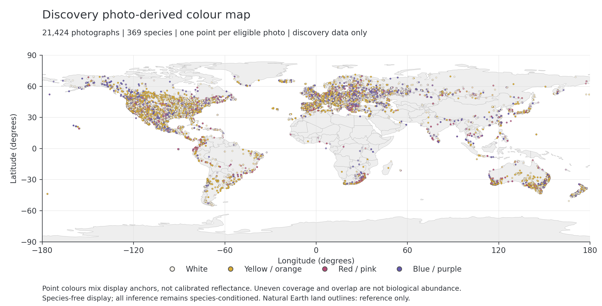
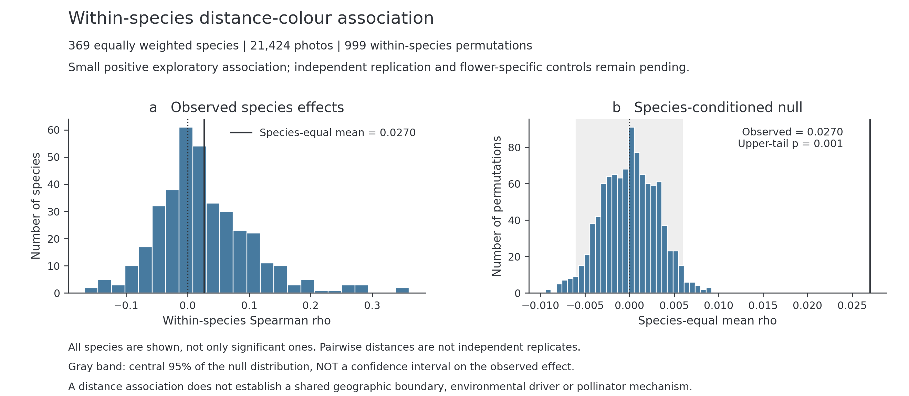

# Separating within-species colour geography from shared boundaries in a repeated global flower-colour atlas

Working manuscript, 7 September 2026. **Discovery draft; not submission-ready.**
This is the active RGFCA manuscript. The six-species Chapter 1 manuscript and
34-species literature comparison remain unchanged legacy studies. The present
draft documents completed discovery evidence; independent replication and
flower-specific validation are pending. It is not an assertion that the active
research goal has been achieved.

## Abstract

An image-first flower-colour atlas must distinguish spatial variation within
species from turnover in species composition and from observational artefacts.
We implemented a repeated global flower-colour atlas (RGFCA) with location-blind
flower-region measurement, balanced species/photo sampling, opportunity-adjusted
spatial fields and species-conditioned randomization. A completed discovery
measurement of 50,000 photographs from 500 species yielded 25,377 classifiable
records; 369 species with at least 40 classifiable photographs contributed 21,424
records to the inferential frame. In a postoutcome exploratory analysis using
all eligible photographs, the equal-species mean rank correlation between
geographic distance and colour dissimilarity was 0.0270213 (999-permutation
upper-tail p = 0.001). The effect was small and did not establish common boundary
geography: the original repeated-field primary test and species-disjoint
commonness test remained unsupported. No environmental process block passed the
fixed five-block correction gate. We prospectively specified replication in the
other 500 candidate species, together with observer, seasonal and matched-image
background controls. Those outcomes are not included here. The current result is
a candidate photo-derived distance-colour association, not independently
validated flower-colour biogeography or an identified ecological mechanism.

## 1. Questions and inferential targets

Community photographs already support landscape flower-colour analysis in
*Erysimum* and high-throughput geographic phenotyping in *Monarda fistulosa*.
[Luong et al. (2023)](https://doi.org/10.1002/aps3.11546),
[McKenzie, Church and Hopkins (2026)](https://doi.org/10.1086/739413).
A much larger North American study linked species-level flower-colour labels
and flowering observations to seasonal hummingbird distributions, with
bumblebees as a comparison. [McKenzie, Berardi and Hopkins (2025)](https://doi.org/10.1016/j.cub.2025.03.035).
Neither image-first phenotyping nor a large collection of flower photographs
is therefore a sufficient novelty claim for the present study.

The motivating question is whether flower-colour differences are spatially
organized within plant species, and whether that organization aligns across
species or with ecological context. These questions require different tests.
A pooled map may change colour because different species occur in different
places even when no species has spatially structured colour variation. Conversely,
species-specific colour gradients can exist without aligning to one common
geographic boundary. Our display suppresses species names, but our inference
does not suppress species identity.

The contribution assessed here is a linked measurement and inference workflow,
not a claim to have invented Monte Carlo resampling. RGFCA constructs bounded,
balanced multispecies map realizations and compares recurring colour-discontinuity
fields against null realizations with identical sampled geometry. An additional
within-species distance analysis asks a simpler, distinct question about monotone
spatial association. Outcome-driven extensions are labelled exploratory and do
not retrospectively replace the original primary analysis.
Ensemble subsampling has established ecological precedents, including range
bagging for environmental niche estimation. [Drake (2015)](https://doi.org/10.1098/rsif.2015.0086).
Our proposed contribution is the separation of inferential targets and their
linked measurement, opportunity and replication checks, not a verified claim
of methodological priority.

## 2. Methods

### 2.1 Discovery measurement and inferential frame

The fixed discovery allocation selected 500 species from a 1,000-species candidate
frame, with 100 photographs per selected species. Measurement used the frozen
flower-region detector and segmentation pipeline without geographic context.
All 50,000 terminal records, including non-evaluable measurements, were retained
before coordinates and colours were joined. Automated classifiability is a
measurement gate, not verification of a biological colour morph.

The measured representation is a continuous mixture over four grouped palette
components: white, yellow/orange, red/pink and blue/purple. It is not calibrated
spectral reflectance, a pigment assay or a model of pollinator colour vision.
Species entered inference when at least 40 photographs passed the frozen
classifiability rule. The resulting frame contained 369 species and 21,424
photographs. The remaining records were not silently repaired or replaced.

Published photographic validation provides reasons to investigate visible
colour, but does not calibrate our masks or palette. In particular, ordinary
photographs do not recover ultraviolet information needed for some questions
about pollinator perception. [Laitly et al. (2021)](https://doi.org/10.1002/ece3.7307).

### 2.2 Balanced repeated spatial fields

The frozen RGFCA schedule comprised 200 observed realizations, each using 250
species and 20 photographs per included species. Species and photograph inclusion
were balanced across realizations. Within-species colour-discontinuity support
and sampled edge opportunity were mapped to the same global field before
aggregation. Every null realization preserved the sampling schedule, species,
coordinates and graph geometry, while reassigning complete colour vectors within
species. Repetitions assess sampling stability; they are not 200 independent
biological replicates and do not make unsampled regions representative.

The repeated-field primary result, scale sensitivities and species-disjoint
commonness analysis remain their own frozen evidence family. A positive result
from the distinct omnibus below cannot rescue any of these decisions.

### 2.3 Exploratory within-species spatial omnibus

For each eligible species we computed Spearman's correlation between great-circle
distance and Jensen-Shannon colour dissimilarity over every unordered photo pair.
The global statistic was the arithmetic mean of all 369 species correlations;
species received equal weight regardless of their number of photographs or pairs.
The frozen rule assigned zero to a constant colour-distance vector and would
stop, rather than drop a species, if geographic distances were non-evaluable.

For each of 999 randomizations we reassigned complete colour vectors among fixed
coordinates within each species, recomputed all species statistics and averaged
them with the same weights. The one-sided Monte Carlo p-value was
`(1 + number of null means >= observed mean) / 1000`. Pairwise observations were
not treated as independent, and asymptotic pair-count-based p-values were not
used. The randomizations are Monte Carlo draws, not exhaustive enumeration of
all possible assignments. Their validity is conditional on the stated
exchangeability null; they do not by themselves eliminate observer, season,
background or spatially patterned measurement effects.
The plus-one calculation follows finite Monte Carlo testing principles;
0.001 is its minimum attainable reported p-value with 999 draws, not a claim
about the exact exhaustive tail probability.
[Phipson and Smyth (2010)](https://doi.org/10.2202/1544-6115.1585).

This analysis is exploratory because earlier descriptive G3 outcomes were
already known. All 20 nonoverlapping species shards, all 999 reconstructed global
null means, the complete species/photo census, eight focused tests and 12 direct
SciPy equivalence checks passed before the result was recorded. The maximum
direct-check difference was 6.94e-17. No new permutation result was obtained in
preparing this manuscript or its figures.

### 2.4 Prospective replication and falsification

The complementary 500 candidate species provide 50,000 previously unmeasured
photographs. The fixed reserve cohort has no observation/photo-ID overlap with
discovery or the listed earlier measurement sets. Before reserve pixels were
opened, the cohort, measurement rules, primary estimand and all three sensitivity
controls were fixed. The inference implementation was subsequently tested while
blind measurement was running, without reading reserve outcomes. This timing is
distinguished from the earlier design freeze.

Replication requires the fixed positive primary distance-colour result and
the prospectively required observer-pair exclusion, calendar-quarter-stratified
randomization and matched flower-minus-background differential. All must pass
their specified gates for the stronger flower-specific robust-replication label.
The seasonal control is a calendar proxy, not a direct phenological measurement.
All 256 terminal measurement partitions and the exact cohort census must pass
before any reserve inference. Partial successful subsets are not analysed.

Taxon-disjoint replication still shares the platform and measurement model and
may share observers and regions. It therefore tests transfer within this design,
not independence from every systematic observation error. A passing result would
not on its own identify a causal environmental or pollination mechanism.
The distinction is consistent with structured-validation work: the split must
match the intended transfer claim, and a different blocking axis tests a
different kind of generalization. [Roberts et al. (2017)](https://doi.org/10.1111/ecog.02881).

## 3. Discovery results

### 3.1 Coverage and measurements

The completed discovery measurement retained 50,000 terminal records, of which
25,377 were classifiable and 24,623 were not. The eligible 369-species frame used
21,424 records. Figure 1 shows these records at their recorded coordinates.
Geographic coverage is uneven; density and pooled colour turnover in this display
are not estimates of global plant abundance or shared transition boundaries.

### 3.2 A small positive distance-colour association

The observed equal-species mean rho was **0.0270213**, compared with a null mean
of 0.0000396 and upper-tail p = **0.001**. Species effects varied in direction;
the median was 0.0164009 and 60.4% of observed coefficients were positive. Nine
of 369 species passed the exploratory BH threshold. Neither the positive
fraction nor the BH-detectable count estimates the biological prevalence of
spatial organization.

The central null interval was [-0.0060083, 0.0058957]. It is **not a confidence interval**
on the observed effect. Statistical detectability does not turn the small mean
coefficient into a large effect or imply that most within-species variation is
geographically explained. Figure 2 shows every species coefficient and all 999
global null values rather than a selected set of significant species.

### 3.3 Shared geography and environmental interpretation remain unresolved

The repeated-field primary test remained unsupported (p = 0.070), despite a
fine-scale sensitivity result of p = 0.006. Species-disjoint commonness was also
unsupported (p = 0.856; median fold correlation approximately -0.088). No block
passed the fixed five-block Holm gate in the expanded environmental panel.
The thermal block's mean partial rho was 0.0083614, with adjusted p = 0.050,
which did not pass the frozen strict decision threshold.

Qualification simulations also failed to recover specified moderately shared
signals adequately under the tested designs. These failures are not evidence of absence
of biological boundaries in nature. Synthetic recovery frequencies must not be
reported as ecological prevalence. Failed source access or incomplete technical
execution likewise cannot be converted into an ecological negative.

## 4. Interpretation and limitations

The discovery analysis motivates independent assessment of a weak, species-equal
photo-derived spatial association. It does not yet establish that the signal is
specific to flowers rather than spatial patterns in backgrounds, season,
observer practice or acquisition conditions. The current map is a descriptive
view of an opportunistic, measurement-filtered sample, not all flowers on Earth.
iNaturalist observer specialization and incompletely specified sampling
processes require explicit consideration. [Di Cecco et al. (2021)](https://doi.org/10.1093/biosci/biab093).
Thinning performance also depends on the modelling target and evaluation
criterion; distribution-model studies do not validate a universal thinning
distance or this study's admission thresholds. [Steen et al. (2021)](https://doi.org/10.1111/2041-210X.13525).

A monotone distance statistic can miss local patchiness, non-monotone transitions
and species-specific boundaries. More randomizations would refine tail precision
but would not increase biological sample size, restore missing spatial cells or
resolve a weakly identified boundary model. Additional species and denser
within-species geographic sampling address different limitations; future designs
must freeze their admissibility and resolution rules before inspecting outcomes.

Testing colour's spatial structure is not the same as testing association
between two autocorrelated spatial fields. Unrestricted permutations can be
invalid for the latter; controlling geographic distance alone is not a general
solution. [Guillot and Rousset (2013)](https://doi.org/10.1111/2041-210X.12018).
Thus retaining coordinate geometry in our null is not a claim to retain the
colour field's autocorrelation or to have isolated an environmental cause.

The present inferential claim is deliberately narrower than the original shared
boundary motivation. Environmental boundaries and pollinator biogeographic
regions remain candidate ecological questions, not substitutes that can be tried
until one yields a favourable p-value. Such analyses require verified source
layers, outcome-independent definitions, appropriate nulls and a new independent
validation route. All prior non-support and non-evaluable decisions remain in
the record.
Work on a plant and its specialist bee further illustrates why colour groups,
regional climate responses and phenology need matched biological definitions.
[Xie et al. (2022)](https://doi.org/10.1111/nph.18361).
Our calendar-quarter control is not a measured flowering stage; a future
pollinator analysis must not equate a broad distribution polygon with observed
visitation or fitness effects.

## 5. Reproducibility and completion gates

Discovery evidence is fixed at commit
`29584f3ad7ae0cd99a1d8f43459252af38f615da` and run
[34088925008](https://github.com/zuizui0223/fcp/actions/runs/34088925008).
The figure builder verifies exact committed source-byte hashes, reconstructs
reported numerical summaries, checks every photo/species count and produces
PNG/PDF pairs with a source/output manifest. Basemap geometry is display-only.
[Figure contracts and complete legends](RGFCA_PUBLICATION_FIGURES.md) define the
palette display, full denominators and visual limitations. A licensed ROI-crop
photo bar remains absent; palette swatches are not presented as photographs.

Before this draft can be submitted, it requires complete independent replication
and matched-background evaluation, completion of the submission-wide citation audit,
final ecological interpretation consistent with every control, a verified real
photo bar or an explicit final omission, a complete manuscript/SI evidence ledger,
and an audited reproducibility/submission package. These are outstanding work,
not cosmetic omissions. No submission or claim of readiness is authorized by
this discovery draft.

The bounded core literature audit now checks the image/ecology precedents and
statistical interpretation cited below. It is not a systematic review or a
complete software/data-provider bibliography. Exact comparisons to unread final
Methods are not asserted. Source access and claim limits are recorded in the
[image/ecology audit](RGFCA_IMAGE_ECOLOGY_LITERATURE_AUDIT.md) and
[statistical audit](RGFCA_STATISTICAL_LITERATURE_AUDIT.md). Citation tests check
internal consistency with that reading record, not scientific validity.

## Source ledger

- Measurement denominator and lineage: [measurement result](supporting/global_monte_carlo_measurement_result_v1.json).
- Omnibus statistic, null and audit: [omnibus result](supporting/global_rgfca_within_species_spatial_omnibus_result_v1.json), [fixed contract](supporting/global_rgfca_within_species_spatial_omnibus_contract_v1.json).
- Repeated atlas estimand and schedule: [method](REPEATED_GLOBAL_FLOWER_COLOUR_ATLAS_METHOD.md).
- Sharedness and environmental decisions: [current status and linked fixed results](RGFCA_RESEARCH_STATUS.md).
- Replication design and execution receipts: [reserve protocol](RGFCA_RESERVE_REPLICATION.md).
- Figure provenance: [manifest](supporting/rgfca_publication_figure_manifest_v1.json).

## References

- Di Cecco, G. J., Barve, V., Belitz, M. W., Stucky, B. J., Guralnick, R. P., and Hurlbert, A. H. (2021). Observing the Observers: How Participants Contribute Data to iNaturalist and Implications for Biodiversity Science. *BioScience* 71(11):1179–1188. [10.1093/biosci/biab093](https://doi.org/10.1093/biosci/biab093).
- Drake, J. M. (2015). Range bagging: a new method for ecological niche modelling from presence-only data. *Journal of the Royal Society Interface* 12(107):20150086. [10.1098/rsif.2015.0086](https://doi.org/10.1098/rsif.2015.0086).
- Guillot, G., and Rousset, F. (2013). Dismantling the Mantel tests. *Methods in Ecology and Evolution* 4:336–344. [10.1111/2041-210X.12018](https://doi.org/10.1111/2041-210X.12018).
- Laitly, A., Callaghan, C. T., Delhey, K., and Cornwell, W. K. (2021). Is color data from citizen science photographs reliable for biodiversity research? *Ecology and Evolution* 11:4071–4083. [10.1002/ece3.7307](https://doi.org/10.1002/ece3.7307).
- Luong, Y., Gasca-Herrera, A., Misiewicz, T. M., and Carter, B. E. (2023). A pipeline for the rapid collection of color data from photographs. *Applications in Plant Sciences* 11(5):e11546. [10.1002/aps3.11546](https://doi.org/10.1002/aps3.11546).
- McKenzie, P. F., Berardi, A. E., and Hopkins, R. (2025). Delayed flowering phenology of red-flowering plants in response to hummingbird migration. *Current Biology* 35(9):2175–2182.e3. [10.1016/j.cub.2025.03.035](https://doi.org/10.1016/j.cub.2025.03.035).
- McKenzie, P. F., Church, S. H., and Hopkins, R. (2026). High-Throughput iNaturalist Image Analysis Reveals Flower Color Divergence in Monarda fistulosa. *The American Naturalist* 208(1):101–109. [10.1086/739413](https://doi.org/10.1086/739413).
- Phipson, B., and Smyth, G. K. (2010). Permutation P-values should never be zero: calculating exact P-values when permutations are randomly drawn. *Statistical Applications in Genetics and Molecular Biology* 9:Article 39. [10.2202/1544-6115.1585](https://doi.org/10.2202/1544-6115.1585).
- Roberts, D. R., Bahn, V., Ciuti, S., Boyce, M. S., Elith, J., Guillera-Arroita, G., Hauenstein, S., Lahoz-Monfort, J. J., Schröder, B., Thuiller, W., Warton, D. I., Wintle, B. A., Hartig, F., and Dormann, C. F. (2017). Cross-validation strategies for data with temporal, spatial, hierarchical, or phylogenetic structure. *Ecography* 40:913–929. [10.1111/ecog.02881](https://doi.org/10.1111/ecog.02881).
- Steen, V. A., Tingley, M. W., Paton, P. W. C., and Elphick, C. S. (2021). Spatial thinning and class balancing: Key choices lead to variation in the performance of species distribution models with citizen science data. *Methods in Ecology and Evolution* 12(2):216–226. [10.1111/2041-210X.13525](https://doi.org/10.1111/2041-210X.13525).
- Xie, Y., Thammavong, H. T., and Park, D. S. (2022). The ecological implications of intra- and inter-species variation in phenological sensitivity. *New Phytologist* 236(2):760–773. [10.1111/nph.18361](https://doi.org/10.1111/nph.18361).
