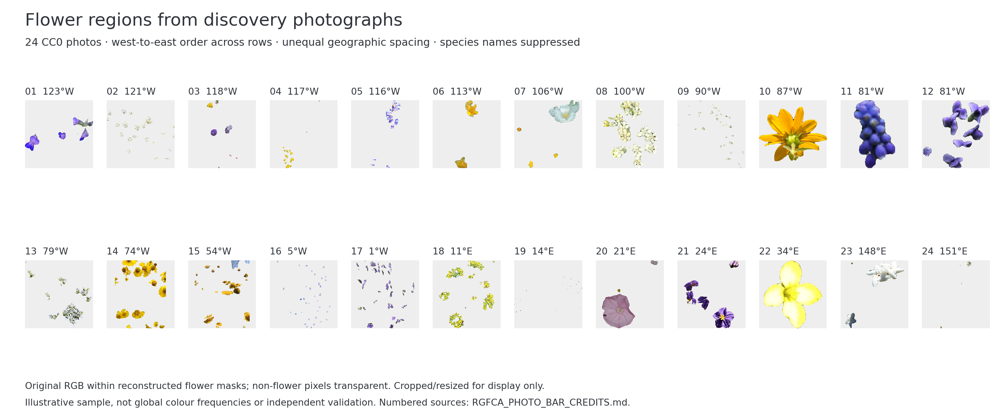

# Discovery-only real flower ROI photo bar

Display protocol, 7 September 2026. This is a new publication illustration, not
a new ecological test or a change to the frozen measurements. Original discovery
pixels/colours have already been analysed; this is not a preoutcome scientific
registration. No reserve outcomes or images are used. Current status: all 24
licensed crops and the PNG/PDF photo bar are reconstructed and verified.

The metadata plan contains 24 species and 24 observers, selected from 659 CC0
photos with credits. Its canonical SHA-256 is
`63e916f4833d938bef371a03e0cfdbeec76a58f7e8e7f18b712f7e0b0cbc0246`.
See [the fixed plan](supporting/rgfca_photo_bar_plan_v1.json). The limited CC0
sample is geographically uneven and must not be described as representative
coverage of the world's flowers.

## Selection and chart contract

Question: what do actual measured flower regions look like among the available
public photographs? The figure illustrates photo-derived measurement, not colour
frequencies, continuous coverage, effect size, or shared geographical boundaries.

- Source: the completed 369-species / 21,424-photo discovery frame at
  `29584f3ad7ae0cd99a1d8f43459252af38f615da`, with exact source SHA-256 checks.
- Display pool: only photos recorded as **CC0** with a nonempty credit. This
  additional licensing filter applies to the illustration only, not inference.
- Selection sees metadata only after the original eligibility rule. Sort the
  pool by longitude then numeric photo ID, divide the ordered records into 24
  consecutive equal-count rank bins, and select the lowest SHA-256 rank in each
  bin subject to no repeated species or observer across the displayed sample.
  Rank salt: `fcp-rgfca-photo-bar-v1`. A bin without an admissible candidate stops
  the plan; no colour-directed repair. The 24-slot plan is saved before any
  display reacquisition. No selection uses hue, effect size or significance.
- Form: static scientific photographic strips, 12 columns × 2 rows, ordered
  west-to-east across rows. This is not a line/heatmap interpolation. Each tile
  has its stable slot number and rounded longitude; unequal geographic spacing
  and the CC0-only sample are explicit in the subtitle.
- Rendering: PNG/PDF, 12 × 5 inches, white page, charcoal labels and light-gray
  tile backgrounds. The photo RGB is the evidence, not a fabricated palette.
  There is no taxon legend or OpenAI branding. Full per-photo credits and source
  links accompany the figure.

## Acquisition, rights and reproduction

Before downloading image pixels, verify **all** selected photo IDs on the public
iNaturalist observation endpoint, require an unchanged CC0 declaration and retain
the photo-level credit. An observation license is not a photo license. Missing,
changed or ambiguous metadata stops acquisition; do not replace a selected photo.
iNaturalist explains the distinction in its [photo-use guidance](https://help.inaturalist.org/en/support/solutions/articles/151000169918)
and [licensing guidance](https://help.inaturalist.org/en/support/solutions/articles/151000173511).
CC0 permits reuse but does not resolve every possible privacy or third-party
right; see the [CC0 deed](https://creativecommons.org/publicdomain/zero/1.0/).
No photographer endorsement is implied.

Use the original large-image URL and require the exact original image SHA-256.
Unexpected HTTP redirects are rejected, not followed to substitute sources.
Instantiate the unchanged qualified ROI-v4 runtime with its pinned detector and
EfficientSAM weights. Recheck admitted status, original flower/background pixel
counts and all twelve flower palette counts. Failure remains a terminal display
failure without replacement. These checks reproduce retained summaries; the
original full mask bitmaps were not saved, so do not claim independently proved
bitwise identity of the reconstructed masks.

For successful photos, retain original RGB inside the reconstructed flower mask,
make pixels outside that mask transparent, and crop to the mask's bounding
rectangle. Record original oriented dimensions, bounding rectangle, full mask
digest and crop digest. No recolouring, white-balance correction, inpainting,
generative images, manual ROI adjustment or aesthetic replacement is allowed.
Render each crop with preserved aspect ratio; resizing is display-only.

Original source images remain ephemeral in memory. This separate, explicitly
licensed publication route may retain the derived RGBA flower crops, credits,
manifest and figure; it does not change the original measurement workflow's
no-source-image-artifact rule. The estimator receives only the image, not taxon
or coordinate inputs; this replay is nevertheless postoutcome display work and
is not described as a new blinded measurement experiment.

## Completion and QA

All 24 selected IDs, rights checks and reconstruction checks are required before
claiming the complete photo bar. Record every attempted slot and error; a partial
successful subset is not silently presented as the original design. A failed
display has no bearing on a scientific non-support decision. Inspect the final
figure for layout, traceability and inappropriate non-floral/private content;
such an issue blocks release rather than authorizing manual alteration or a
replacement sample. Display QA is not botanical classification or validation of
the scientific effect.

The final figure must include credits/source links, a complete execution receipt,
two-render PNG/PDF identity in the same pinned runtime, and an explicit label:
**Illustrative CC0 discovery sample; not independent validation or a global
flower-colour frequency estimate.** Legacy results and ongoing reserve/background
inference remain unchanged.

## Completed execution and release

[CI 34100227172](https://github.com/zuizui0223/fcp/actions/runs/34100227172), at
`214a939d29512648986620e0abf19cbf1f35addd`, passed all 30 original tests and completed
all 24 photo-level CC0 checks, original image hashes, frozen ROI admission,
flower/background pixel counts and twelve flower-palette counts. Both PNG/PDF
exports reproduced identically on a second render. No source photo was replaced.

Artifact `10010284387` was downloaded and the complete plan, execution receipt,
all 24 RGBA crops and both figure hashes were checked again locally. Its
GitHub-reported archive SHA-256 is
`7abd9f0ce278e0fbb5bb2c2247af77bf87d2628e5ee50cc95914677cc509caa1`.
See the [release receipt](supporting/rgfca_photo_bar_release_v1.json),
[figure manifest](supporting/rgfca_photo_bar_figure_manifest_v1.json),
[execution record](figures/rgfca_photo_bar_v1/photo_bar_execution.json) and
[per-slot source credits](figures/rgfca_photo_bar_v1/RGFCA_PHOTO_BAR_CREDITS.md).
The API's CC0 credit text is generic (`no rights reserved`); source photo and
observation pages are retained, not invented photographer names or inferred
photographer identity from the observation contributor.

The final PNG was visually inspected across all 24 slots. Labels and limits are
legible, and no private content was visible at this display scale. Some masks
are sparse or fragmented and some flowers are small in the union rectangle;
this is retained and disclosed rather than manually cleaned or resampled.
The check is not botanical verification or evidence of mask accuracy.
The continuing publication CI verifies committed provenance and renders these
existing crops twice without another network or model measurement.

Post-release CI `34101672366` passed all 61 expanded tests but failed the separate
export command before rendering with `ModuleNotFoundError: fcp_pipeline`:
the test step supplied `PYTHONPATH`, while the standalone export step did not.
The export now uses Python's repository-root module invocation. A regression
test runs the exact workflow command with inherited `PYTHONPATH` removed;
it reproduced the original failure before the one-line invocation fix.
No crop, source receipt, measurement, inference, palette or mask was changed,
and this technical failure did not trigger reacquisition.

