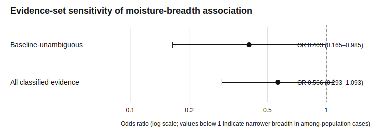
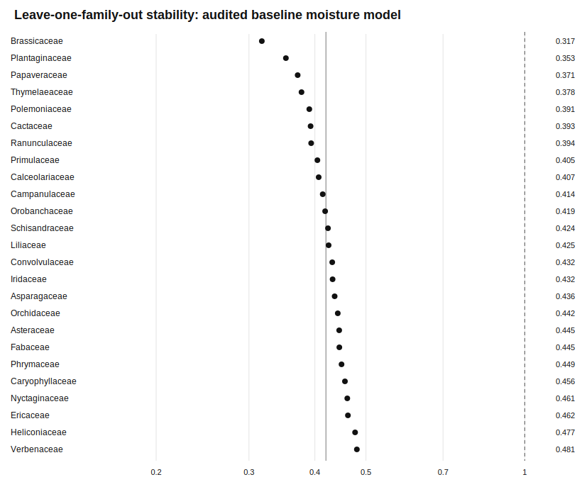

# Moisture niche breadth and spatial organization of flower-colour variation

**Running title:** Flower-colour variation and climate

## Abstract

### Aim

Intraspecific phenotypic variation may occur through local coexistence or geographic differentiation, but comparative studies rarely treat spatial organization as a distinct property. We tested whether documented within-population flower-colour polymorphism and geographically structured flower-colour variation differ in occupied climatic niche breadth.

### Location

Global, literature-derived sample.

### Taxon

Angiosperms with documented natural intraspecific flower-colour variation.

### Methods

We classified documented flower-colour variation as within-population, among-population, mixed or unclear from retained source text. The audited baseline-unambiguous set preserved source identifiers, evidence snippets and classification decisions. We combined binary classifications with GBIF occurrences and WorldClim 2.1 data at 10 arc-min resolution. Binomial generalized linear models related among-population organization to standardised niche metrics while controlling for occupied-cell count. We used family-clustered sandwich covariance, 9,999 label permutations and leave-one-family-out refits. Five metrics were evaluated at four occurrence thresholds.

### Results

The baseline-unambiguous moisture model included 34 species from 25 families: 20 within-population and 14 among-population cases. Geographically structured variation was negatively associated with realised moisture niche breadth (odds ratio = 0.426, family-clustered 95% confidence interval = 0.184–0.985; clustered Wald p = 0.0460). Permutation support was borderline (two-sided p = 0.0556). The association remained negative after each represented family was omitted, with leave-one-family-out odds ratios of 0.317–0.481. The estimate was weaker in the broader evidence set (odds ratio = 0.563, 95% confidence interval = 0.292–1.085; permutation p = 0.0944).

### Main conclusions

The spatial organization of flower-colour variation showed an evidence-sensitive association with occupied moisture niche breadth. Because support differed between uncertainty procedures and weakened with less certain classifications, the result is exploratory. The analysis does not test morph-specific tolerance, local adaptation or climatic causation.

**Keywords:** climatic niche breadth, evidence synthesis, flower-colour variation, GBIF, geographic differentiation, intraspecific polymorphism, macroecology

## Introduction

Intraspecific phenotypic variation can be expressed through local coexistence, geographic differentiation or a combination of both. These configurations are biologically distinct. Local coexistence requires multiple forms to persist under at least partly shared demographic and environmental conditions, whereas geographic differentiation may reflect spatial environmental variation, dispersal limitation, demographic history or other forms of regional structure. Combining these configurations into a single category can therefore obscure the spatial scale at which phenotypic variation is documented.

Flower colour provides a tractable system for examining this distinction. Floral pigmentation can affect interactions with pollinators, but colour evolution may also reflect abiotic selection, pleiotropic effects of pigment-pathway genes, genetic drift, gene flow and mating-system processes (Rausher, 2008; Trunschke et al., 2021; Wessinger & Rausher, 2012). These mechanisms need not operate uniformly across a species' range, and their relative contributions can differ among populations and colour variants (Narbona et al., 2018). Flower colour is therefore both an ecologically meaningful trait and a useful system for asking how intraspecific variation is arranged geographically.

Terminology is central to this comparison. Flower-colour polymorphism is conventionally defined as the coexistence of at least two discrete flower-colour variants in the same population (Narbona et al., 2018). We consequently use *intraspecific flower-colour variation* as the umbrella term. *Within-population flower-colour polymorphism* denotes documented local coexistence of discrete variants, whereas *geographically structured flower-colour variation* denotes differentiation among populations or regions without retained evidence of local coexistence. Cases supported at both spatial scales are classified as mixed. This hierarchy avoids calling geographically separated variants polymorphic when coexistence has not been demonstrated.

Previous comparative research has related floral pigmentation or average flower-colour properties to geography, temperature, precipitation, radiation and biotic context (Dalrymple et al., 2020; Koski & Ashman, 2016). Individual systems and regional reviews have also documented geographic variation in colour-morph frequencies (Narbona et al., 2018). These approaches establish that floral colour and its frequencies may vary geographically, but they do not test whether species-level occupied climates differ according to whether colour variants are documented as coexisting locally or differentiated geographically. The contribution of the present study is therefore not another general test of whether flower colour covaries with climate. It is a comparison of the documented spatial organization of intraspecific colour variation across taxa.

We assembled a global, literature-derived sample and asked whether documented within-population polymorphism and geographically structured variation differ in species-level occupied climatic niche breadth. The comparison between the two spatial configurations was theory-led, but five climatic metrics were evaluated at four minimum-occurrence thresholds. Moisture niche breadth is therefore reported as the focal association identified within a broader set of models rather than as a prospectively preregistered endpoint. We assessed sensitivity to classification quality, represented plant families, occurrence sampling effort and coarse properties of sampled GBIF occurrence clouds. Our objective was to estimate a comparative association while keeping the boundary between species-level occupied climate and morph-level mechanisms explicit.

## Methods

### Study design and inferential population

The study population comprised species identified by the repository workflow as documented natural cases of intraspecific flower-colour variation. The candidate pool was assembled from literature discovery and targeted evidence follow-up rather than sampled randomly from angiosperms. The inferential population is therefore the assembled set of documented cases. The analyses do not estimate the global prevalence of flower-colour variation or the proportions of all angiosperms showing each spatial configuration.

The resolved evidence base contained 664 candidate species from 140 families. Of these, 111 were retained as validated natural cases and 553 remained deferred. A separate ascertainment analysis related validation status to retained literature effort. Because this analysis concerns validation conditional on candidature, it characterizes the evidence-assembly process rather than biological prevalence.

### Literature discovery and validation

Initial automated discovery queried the OpenAlex works index (Priem et al., 2022) using eight English-language search expressions: `"flower color polymorphism"`, `"flower colour polymorphism"`, `"floral color polymorphism"`, `"floral colour polymorphism"`, `"flower color variation" pollinator`, `"flower colour variation" pollinator`, `"floral color morph"` and `"floral colour morph"`. The implemented defaults retrieved up to two cursor-paginated pages of 200 records for each query. Work identifiers were deduplicated across queries.

Candidate binomials were matched against the repository angiosperm census. A species mention was retained only when the binomial occurred in the title or within a 220-character window around flower-, colour-, pigment-, morph- or polymorphism-related language in an available abstract. Strong flower-colour context increased the evidence score; titles indicating genomes, transcriptomes, checklists, floras or other contexts unlikely to document natural flower-colour variation were penalized. Candidate evidence required a score of at least eight. Source titles, DOI or OpenAlex identifiers and supporting text were retained for audit. Subsequent targeted scripts searched unresolved or high-priority species and fed the resolved review queue.

No explicit language filter was coded, but the English search phrases and dependence on indexed title and abstract metadata may have produced language and database-coverage bias. **Not verified:** the original execution dates of all discovery and follow-up searches, the identities and number of manual screeners, and the procedure for resolving disagreements are not recorded in the latest manuscript materials. These details must be supplied before submission.

### Classification of spatial organization

Each validated case was classified from retained source text as `within_population`, `among_population`, `mixed` or `unclear` (Table 1). Within-population classification required explicit evidence that multiple discrete colour variants coexisted within at least one natural population. Among-population classification required documented differentiation among populations or regions without retained evidence of local coexistence. Evidence for both local coexistence and geographic differentiation produced a mixed classification. Mixed and unclear cases were excluded from binary comparative models.

Source identifiers and evidence snippets were propagated into the analysis dataset and audited. This audit detected that the phrase `within populations` had not been recognized by the initial rule. The rule was corrected and the analysis was rerun; a case supported at both scales was consequently removed from the binary baseline set. The final baseline-unambiguous manifest was frozen without reference to the climatic model results and has SHA-256 digest `416949addd664d6e89230df00fc1e89adad261b51268f24f60cd42770559e217`. The manifest contains 34 model-eligible species from 25 families: 20 within-population and 14 among-population cases. The retained correction-log table contains no post-freeze changes.

A broader evidence set combined baseline-unambiguous classifications with high-confidence literature enrichment. At the minimum 20-cell threshold, this set contained 51 species from 29 families: 33 within-population and 18 among-population cases. The 17 enrichment-only species comprised 13 within-population and four among-population cases; this subset was below the prespecified minimum of 20 species and was not fitted as an independent model.

### Occurrence data

Occurrence records were requested from the GBIF occurrence-search API. For each focal or matched-control taxon, the workflow submitted the canonical scientific name with `hasCoordinate=true` and `occurrenceStatus=present` and retrieved a deterministic first-page sample of no more than 300 records. Requests used four retries with exponential backoff. No basis-of-record restriction was applied.

Records were removed when latitude or longitude was missing, non-finite, outside valid geographic bounds or equal to the coordinate origin (0°, 0°). Coordinates were rounded to three decimal places, and duplicate rounded coordinate pairs were removed within each taxon. No additional country-coordinate consistency check, cultivated-record filter or automated geographic-outlier filter was implemented. This limited cleaning should be considered when interpreting species-level occupied ranges.

The workflow requested 468 focal and control taxa. Coordinate data were obtained for 356 taxa, yielding 53,366 deduplicated coordinate records; no API request failed. Of these taxa, 264 had at least 20 coordinate records.

**Not verified:** the final submission requires a citable GBIF derived-dataset DOI for the exact occurrence download. The workflow currently uses the occurrence-search API and does not provide a permanent GBIF download DOI.

### Climatic variables and occupied-climate summaries

We extracted WorldClim 2.1 bioclimatic data at 10 arc-min resolution (Fick & Hijmans, 2017). The nine retained variables were annual mean temperature (BIO1), temperature seasonality (BIO4), maximum temperature of the warmest month (BIO5), minimum temperature of the coldest month (BIO6), annual temperature range (BIO7), annual precipitation (BIO12), precipitation of the driest month (BIO14), precipitation seasonality (BIO15) and precipitation of the driest quarter (BIO17).

Records lacking any of the nine climatic values were removed. Within a species, records with identical nine-variable climate vectors were deduplicated and treated as occupied climate cells. This operational unit is therefore an occupied combination of raster-cell climate values rather than an independently estimated biological population. The final climate table contained 23,145 occupied records for 354 taxa; 262 taxa met the minimum threshold of 10 occupied climate cells.

The nine climatic variables were standardised across the combined focal and control occurrence dataset. A principal components analysis was fitted to the standardised values. The first three axes explained 45.41%, 31.50% and 13.89% of the total variance, respectively.

### Climatic niche metrics

Five species-level metrics described the breadth or heterogeneity of realised occupied climate. Temperature breadth was the mean difference between the 95th and 5th percentiles of BIO1, BIO5, BIO6 and BIO7. Moisture breadth was the corresponding mean percentile range for BIO12, BIO14, BIO15 and BIO17. Climatic heterogeneity was the mean within-species standard deviation across the nine standardised bioclimatic variables. PCA dispersion was the mean Euclidean distance between occupied cells and the species centroid in the first three principal-component dimensions. PCA hull area was the convex-hull area of occupied cells in the first two principal-component dimensions.

Metrics were evaluated at minimum occupied-climate-cell thresholds of 10, 20, 30 and 50. The five metrics crossed with the four thresholds produced 20 model specifications. These metrics describe realised occupied climate represented in the sampled records. They do not estimate fundamental physiological tolerance and were not calculated separately for colour morphs.

### Spatial-organization models

For each metric and minimum-cell threshold, we fitted a binomial generalized linear model with a logit link:

`among ~ metric_z + effort_z`

The response equalled one for geographically structured variation and zero for within-population polymorphism. `metric_z` was the standardised climatic metric, and `effort_z` was standardised `log1p(n_climate_cells)`. Rows missing the response, metric, effort covariate or family were excluded. Models required at least 20 species, two response classes and two represented families.

Models were fitted in Python 3.12 using `statsmodels` 0.14.6 (Seabold & Perktold, 2010). Wald standard errors were estimated with family-clustered sandwich covariance. Reported 95% confidence intervals were calculated on the log-odds scale as the coefficient ±1.96 clustered standard errors and exponentiated for odds-ratio intervals. All 20 broader-set models converged in four iterations. The complete model matrix, including sample composition, coefficients, intervals, p-values, effort terms, convergence and fitted-probability ranges, is provided in Table S1.

### Permutation and family-deletion analyses

For the focal analyses at the 20-cell threshold, we evaluated moisture breadth and PCA hull area in the baseline-unambiguous and broader evidence sets. We used a fixed random-number seed of 20260719. For each of 9,999 permutations, spatial-category labels were shuffled among model-eligible species while metrics, effort and family labels remained fixed. The permuted coefficient was estimated from the same binomial model without clustered covariance. The two-sided p-value was calculated as

`(1 + number of |permuted coefficients| ≥ |observed coefficient|) / (1 + number of valid permutations)`.

All 9,999 requested permutations were valid for every estimable model. To assess concentration in individual plant families, we also refitted the unclustered model after omitting each represented family in turn. These analyses evaluate label-exchangeability and family concentration, respectively; neither is a phylogenetic comparative analysis.

### Candidate-versus-control comparison

We also tested whether documented colour-variable species generally occupied broader climates than taxonomically matched controls. Controls were selected from outside the complete candidate list and therefore were not asserted to be monomorphic. Focal and control taxa were arranged in focal-species strata and analysed with conditional logistic regression. Each model included a standardised climatic metric and standardised `log1p(n_climate_cells)`. Five metrics were evaluated at four cell thresholds for all controls and for same-genus controls, producing 40 specifications. The complete output is provided in Table S2.

### Coarse occurrence-cloud alternatives

We evaluated two sets of coarse alternatives to the focal relationship. First, models added sampled-range extent and fragmentation summaries derived from GBIF coordinates, including median nearest-neighbour distance, 95% spatial extent, numbers of components at 50- and 100-km thresholds, the fraction in the largest 100-km component, occupied 1° grid cells and an integrated 100-km connectivity model. These models included climate-cell effort and GBIF-record effort.

Second, we formed distance-threshold components from sampled occurrences and calculated climatic separation among retained components. Environmental-turnover sensitivity analyses crossed component thresholds of 50, 100 and 200 km with minimum component sizes of three and five records. These components are unsupervised summaries of GBIF point clouds, not verified biological populations, barriers, gene-flow units or morph distributions. Full results are provided in Table S5.

## Results

### Evidence base and ascertainment

The resolved evidence base contained 664 candidate species, of which 111 were validated as natural cases of intraspecific flower-colour variation. Validation probability showed a nonlinear association with retained literature effort. A quadratic model had an AIC 10.46 units lower than a linear model. In the quadratic model, the coefficient for log-transformed work count was positive (odds ratio = 98.22, 95% confidence interval = 21.01–459.25, p = 5.56 × 10⁻⁹), whereas its squared term was negative (odds ratio = 0.402, 95% confidence interval = 0.245–0.657, p = 2.83 × 10⁻⁴), indicating increasing and then saturating validation probability. This pattern demonstrates strong research-effort dependence in the assembled sample and precludes interpretation as a census of angiosperm prevalence.

### Candidate-versus-control climatic niches

The matched dataset contained 70 focal species and 243 control species. Across the 40 conditional-logit specifications, there was no consistent evidence that documented colour-variable species occupied broader climatic niches than taxonomically matched controls (Table S2). In the same-genus comparison at the 20-cell threshold, 54 focal strata and 188 taxon rows were retained. Odds ratios ranged from 0.830 for temperature breadth to 1.184 for PCA hull area; all five confidence intervals included one and p-values ranged from 0.377 to 0.934 (Table 3).

### Spatial organization across the full specification set

All 20 broader-evidence spatial-organization models converged. The broader set contained 57 classified species with climatic metrics before thresholding: 37 within-population and 20 among-population cases. Depending on the cell threshold, individual models contained 48–55 species.

Across the 20 specifications, every climatic-metric odds-ratio estimate was below one, with values from 0.532 to 0.836, but every family-clustered 95% confidence interval included one (Table S1). Clustered Wald p-values ranged from 0.052 to 0.552. At the 20-cell threshold, odds ratios were 0.729 for PCA dispersion, 0.761 for climatic heterogeneity, 0.684 for PCA hull area, 0.822 for temperature breadth and 0.563 for moisture breadth. This pattern provides multiplicity context for the focal moisture result: the direction was not unique to one threshold, but the broader-set uncertainty did not exclude an odds ratio of one.

### Audited baseline association

The baseline-unambiguous moisture model included 34 species from 25 families: 20 within-population and 14 among-population cases (Table 2). The standardised moisture-breadth coefficient was −0.854, corresponding to an odds ratio of 0.426. The family-clustered 95% confidence interval was 0.184–0.985, and the clustered Wald p-value was 0.0460. The model converged in four iterations, with fitted probabilities from 0.050 to 0.701.

The two-sided permutation p-value was 0.0556 from 9,999 valid permutations. After each represented family was omitted, moisture-breadth odds ratios ranged from 0.317 to 0.481 and remained below one in all 25 refits (Figure 2; Table S4). Thus, the negative estimated direction was not attributable to a single represented family, although permutation support was borderline.

PCA hull area did not show comparable statistical support in the baseline-unambiguous set (odds ratio = 0.632, family-clustered 95% confidence interval = 0.332–1.202; Wald p = 0.162; permutation p = 0.318; Table 2). The contrast between moisture breadth and PCA hull area further supports treating moisture breadth as an exploratory focal association rather than a general response across climatic metrics.

### Evidence-quality sensitivity

The broader 20-cell moisture model contained 51 species from 29 families: 33 within-population and 18 among-population cases. Its estimate was weaker than the audited baseline estimate (odds ratio = 0.563, 95% confidence interval = 0.292–1.085; clustered Wald p = 0.0861; permutation p = 0.0944; Figure 1). Leave-one-family-out odds ratios ranged from 0.445 to 0.616 and remained below one. The broader-set attenuation indicates that the magnitude and uncertainty of the association depend on classification evidence quality.

The enrichment-only subset contained 17 species and therefore was not estimated independently under the prespecified 20-species minimum. The strict-versus-broad comparison diagnoses sensitivity to the evidence set; it does not establish biological effect heterogeneity between evidence sources.

### Coarse occurrence-cloud alternatives

The fragmentation dataset contained 55 model-complete species from 31 families. Added fragmentation and connectivity terms had odds ratios from 0.574 to 1.061; every 95% confidence interval included one and the smallest p-value among these added terms was 0.280 (Table S5). The moisture-breadth odds ratio remained below one across these models, ranging from 0.480 to 0.597, although its intervals generally included one.

At the 100-km threshold with a minimum component size of three records, 48 species had at least two retained components. The environmental-turnover estimate was imprecise (odds ratio = 0.852, 95% confidence interval = 0.296–2.449; p = 0.766). Across all six turnover specifications, turnover odds ratios ranged from 0.724 to 1.139, with three estimates in each direction and no p-value below 0.05. The examined coarse point-cloud metrics therefore did not clearly account for the focal association. They cannot exclude environmental sorting among colour morphs because occurrence records were not labelled by flower-colour state.

## Discussion

The audited comparison identified a negative association between realised moisture niche breadth and the documented spatial organization of flower-colour variation. Species classified as geographically structured had a lower estimated odds of occupying the among-population category as moisture breadth increased, relative to species with documented local coexistence. The estimated direction remained negative in every leave-one-family-out analysis. However, the family-clustered interval only narrowly excluded an odds ratio of one, the permutation p-value was 0.0556, and the estimate weakened when less certain classifications were included. These results provide suggestive, evidence-sensitive comparative support rather than confirmatory evidence for a general climatic relationship.

Several explanations remain compatible with the pattern. Geographic differentiation may be documented more often in species occupying restricted moisture contexts, or local coexistence may persist across broader realised conditions. Alternatively, dispersal, demographic history, range geometry or research practice may covary with both occupied moisture breadth and the documented spatial category. Species-level breadth could also differ for reasons unrelated to flower colour. Because the GBIF records were not labelled by morph and no local environmental contrast was assigned to a colour state, the present analysis cannot distinguish among these explanations or test local adaptation.

The main conceptual contribution is the explicit separation of local coexistence from geographic differentiation. Flower-colour studies have long emphasized pollinators, abiotic selection and pigment-pathway constraints (Rausher, 2008; Trunschke et al., 2021; Wessinger & Rausher, 2012), and comparative research has shown that floral pigmentation covaries with broad environmental gradients (Dalrymple et al., 2020; Koski & Ashman, 2016). The present result concerns a different level of organization: whether colour variants are documented together within populations or separated among populations. Treating this distinction as a comparative trait retains biological information that is lost when all intraspecific variation is grouped as flower-colour polymorphism.

Classification uncertainty is part of that inference. Correcting one unrecognized plural phrase moved a species with evidence at both spatial scales out of the binary baseline set and changed the focal estimate. The broader evidence set then produced a weaker association whose interval included one. This sensitivity does not mean that one classification set is error-free and the other invalid. It shows that literature-derived trait states are measured with uncertainty and that source text, decision rules, frozen manifests and correction logs are analytical evidence, not merely administrative records.

Multiplicity also constrains interpretation. Moisture breadth was selected for focal reporting after five climatic metrics were evaluated at four thresholds. Across the broader 20-model matrix, all point estimates were negative, but none of the clustered intervals excluded one. The focal strict-set Wald and permutation results also fall on opposite sides of the conventional 0.05 threshold. Describing the result as simply significant or non-significant would therefore conceal the more informative pattern: a negative effect estimate that was stable to family deletion, borderline under label permutation and attenuated by less certain classifications.

The candidate-versus-control analysis helps delimit the scope of the result. Documented colour-variable species did not consistently occupy broader climates than matched controls. Thus, the focal association does not appear to reflect a general tendency for all documented colour-variable species to have unusually broad climatic niches. Instead, it concerns variation among documented cases in the spatial scale at which colour variation is reported. The controls themselves cannot be assumed monomorphic, however, because their exclusion from the candidate list only indicates that they were not identified by the literature pipeline.

The coarse occurrence-cloud analyses also provide a limited negative check. Neither fragmentation summaries nor generic environmental turnover among unsupervised GBIF components clearly explained the focal association. These results should not be read as evidence that spatial structure is absent. The components are products of record density and distance thresholds, and the records do not identify populations or colour morphs. A direct mechanistic test would require georeferenced colour-state observations, named populations and environmental measurements linked to those states.

Family-clustered covariance and family-deletion refits reduce sensitivity to individual represented families, but they do not establish phylogenetic independence. Flower pigmentation, life history, range size and climatic occupancy may all show phylogenetic structure. A phylogenetic logistic model would therefore be a stronger comparative test. **Not verified:** no dated species-level phylogeny matched to the final analysis set is included in the repository, so a phylogenetic correction has not been performed.

Further limitations arise from the evidence and occurrence data. The sample is non-random and strongly dependent on literature effort. English search phrases, uneven abstract availability and targeted follow-up may favour well-studied taxa and regions. Local coexistence may be under-documented when papers emphasize regional differentiation without exhaustive within-population sampling. GBIF records were limited to a deterministic first page, lacked a basis-of-record filter and received only coordinate validity and 0.001° deduplication checks. Occupied-climate metrics consequently reflect sampled realised distributions and observation processes, not physiological tolerance.

Despite these constraints, the study establishes a reproducible framework for comparing the spatial organization of intraspecific phenotypic variation. The audited evidence suggests that documented geographic differentiation may be associated with narrower occupied moisture breadth than documented local coexistence, while simultaneously showing that the strength of this inference depends on classification quality and uncertainty method. Morph-labelled locality data and phylogenetic models are now needed to determine whether the association generalizes and which ecological or historical processes generate it.

## References

Dalrymple, R. L., Kemp, D. J., Flores-Moreno, H., Laffan, S. W., White, T. E., Hemmings, F. A., & Moles, A. T. (2020). Macroecological patterns in flower colour are shaped by both biotic and abiotic factors. *New Phytologist, 228*(6), 1972–1985. https://doi.org/10.1111/nph.16737

Fick, S. E., & Hijmans, R. J. (2017). WorldClim 2: New 1-km spatial resolution climate surfaces for global land areas. *International Journal of Climatology, 37*, 4302–4315. https://doi.org/10.1002/joc.5086

Koski, M. H., & Ashman, T.-L. (2016). Macroevolutionary patterns of ultraviolet floral pigmentation explained by geography and associated bioclimatic factors. *New Phytologist, 211*(2), 708–718. https://doi.org/10.1111/nph.13921

Narbona, E., Wang, H., Ortiz, P. L., Arista, M., & Imbert, E. (2018). Flower colour polymorphism in the Mediterranean Basin: Occurrence, maintenance and implications for speciation. *Plant Biology, 20*(S1), 8–20. https://doi.org/10.1111/plb.12575

Priem, J., Piwowar, H., & Orr, R. (2022). OpenAlex: A fully-open index of scholarly works, authors, venues, institutions, and concepts. *arXiv*. https://doi.org/10.48550/arXiv.2205.01833

Rausher, M. D. (2008). Evolutionary transitions in floral color. *International Journal of Plant Sciences, 169*(1), 7–21. https://doi.org/10.1086/523358

Seabold, S., & Perktold, J. (2010). Statsmodels: Econometric and statistical modeling with Python. In *Proceedings of the 9th Python in Science Conference* (pp. 92–96).

Trunschke, J., Lunau, K., Pyke, G. H., Ren, Z.-X., & Wang, H. (2021). Flower color evolution and the evidence of pollinator-mediated selection. *Frontiers in Plant Science, 12*, 617851. https://doi.org/10.3389/fpls.2021.617851

Wessinger, C. A., & Rausher, M. D. (2012). Lessons from flower colour evolution on targets of selection. *Journal of Experimental Botany, 63*(16), 5741–5749. https://doi.org/10.1093/jxb/ers267

## Data Accessibility Statement

Analysis code, source-level evidence fields, frozen classification manifests, correction logs and model outputs are maintained in the public GitHub repository `zuizui0223/fcp`. The exact files supporting the manuscript tables are indexed in `docs/jbi_supporting_information_index.md`.

**Not verified:** before submission, archive the exact code and data release in a permanent repository and insert its DOI here. A citable GBIF derived-dataset DOI for the occurrence data must also be added. The GitHub repository alone should not be treated as the final preservation record.

## Tables

### Table 1. Operational classification of the documented spatial organization of intraspecific flower-colour variation

| Category | Operational evidence requirement | Included in binary models |
|---|---|---|
| Within-population flower-colour polymorphism | Explicit source evidence that at least two discrete natural flower-colour variants coexist within at least one population | Yes; response = 0 |
| Geographically structured flower-colour variation | Explicit source evidence of differentiation among populations or regions, without retained evidence of local coexistence | Yes; response = 1 |
| Mixed | Retained evidence supports both within-population coexistence and geographic differentiation | No |
| Unclear | Evidence does not resolve the spatial configuration | No |

### Table 2. Focal spatial-organization models at the 20-cell threshold

| Evidence set | Metric | Species | Families | Within / among | Odds ratio | Family-clustered 95% CI | Wald p | Permutation p | Leave-one-family-out OR range |
|---|---|---:|---:|---:|---:|---:|---:|---:|---:|
| Baseline-unambiguous | Moisture breadth | 34 | 25 | 20 / 14 | 0.426 | 0.184–0.985 | 0.0460 | 0.0556 | 0.317–0.481 |
| Baseline-unambiguous | PCA hull area | 34 | 25 | 20 / 14 | 0.632 | 0.332–1.202 | 0.1620 | 0.3184 | 0.547–0.741 |
| All classified evidence | Moisture breadth | 51 | 29 | 33 / 18 | 0.563 | 0.292–1.085 | 0.0861 | 0.0944 | 0.445–0.616 |
| All classified evidence | PCA hull area | 51 | 29 | 33 / 18 | 0.684 | 0.432–1.082 | 0.1046 | 0.2997 | 0.624–0.762 |

*Note.* Odds ratios are for among-population rather than within-population organization per one standard-deviation increase in the climatic metric, controlling for standardised `log1p(n_climate_cells)`. Confidence intervals and Wald p-values use family-clustered sandwich covariance. Permutation tests used 9,999 valid label permutations.

### Table 3. Same-genus candidate-versus-control models at the 20-cell threshold

| Metric | Strata | Rows | Odds ratio | 95% CI | p |
|---|---:|---:|---:|---:|---:|
| PCA dispersion | 54 | 188 | 0.923 | 0.598–1.425 | 0.718 |
| Climatic heterogeneity | 54 | 188 | 0.981 | 0.631–1.526 | 0.934 |
| PCA hull area | 54 | 188 | 1.184 | 0.666–2.104 | 0.565 |
| Temperature breadth | 54 | 188 | 0.830 | 0.549–1.255 | 0.377 |
| Moisture breadth | 54 | 188 | 0.958 | 0.592–1.549 | 0.860 |

*Note.* Conditional logistic models compared documented colour-variable focal species with same-genus controls within focal-species strata and included standardised `log1p(n_climate_cells)`. Controls were outside the candidate list but were not verified as monomorphic.

## Figure legends and embedded figures

### Figure 1. Evidence-set sensitivity of the moisture-breadth association

Odds ratios and family-clustered 95% confidence intervals for the association between standardised realised moisture niche breadth and geographically structured rather than within-population flower-colour variation. The audited baseline-unambiguous set contained 34 species from 25 families; the all-classified evidence set contained 51 species from 29 families. Values below one indicate lower odds of among-population organization as moisture breadth increases. The vertical dashed line marks an odds ratio of one.

### Figure 2. Leave-one-family-out stability of the audited baseline moisture-breadth estimate

Odds ratios from 25 unclustered binomial generalized linear models, each fitted after omitting one represented plant family from the baseline-unambiguous dataset. Every estimate remained below one and ranged from 0.317 to 0.481. The solid reference line shows the full baseline estimate (odds ratio = 0.426), and the dashed line marks an odds ratio of one. Family deletion assesses concentration in individual families but is not a phylogenetic correction.

## Supporting Information

The following files are assigned stable manuscript identifiers and indexed in `docs/jbi_supporting_information_index.md`.

- **Table S1.** Complete 20-specification spatial-organization model matrix.
- **Table S2.** Complete candidate-versus-control conditional-logit model matrix.
- **Table S3.** Source-stratified robustness models, including Wald and permutation inference.
- **Table S4.** Leave-one-family-out model estimates.
- **Table S5.** Coarse occurrence-cloud fragmentation and environmental-turnover models.
- **Table S6.** Frozen baseline-unambiguous classification manifest.
- **Table S7.** Post-freeze classification correction log.
