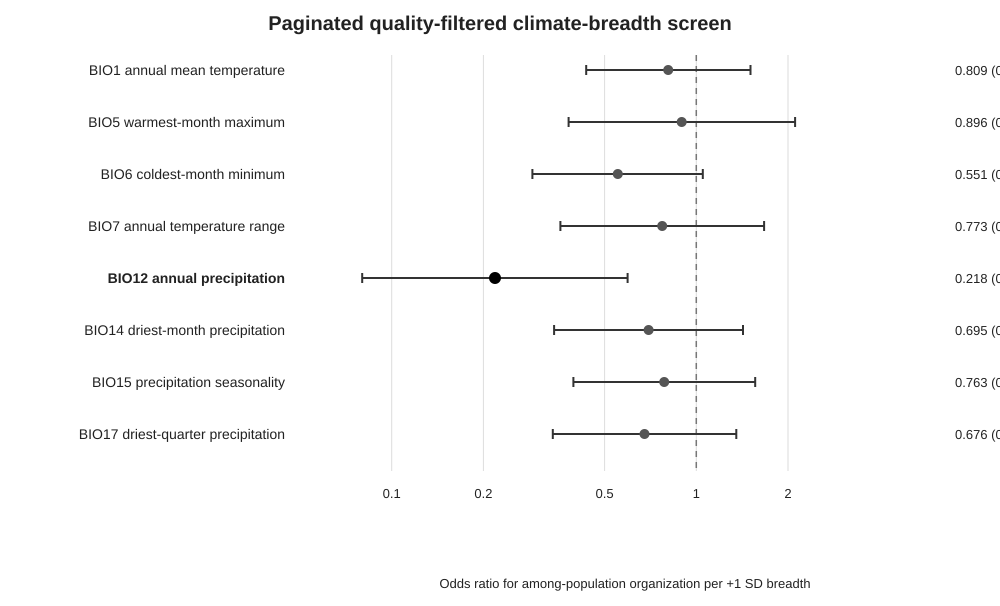
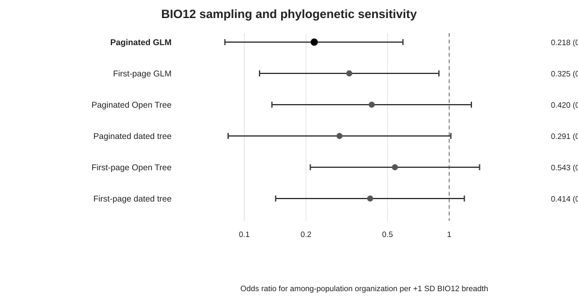

# Annual-precipitation breadth and spatial organization of flower-colour variation

**Running title:** Flower-colour variation and precipitation

## Abstract
### Aim

Intraspecific phenotypic variation may occur through local coexistence or geographic differentiation, but comparative studies rarely treat spatial organization as a distinct property. We tested whether these two configurations differ in the breadth of species-level occupied climate, focusing on annual precipitation.

### Location

Global, literature-derived sample.

### Taxon

Angiosperms with documented natural intraspecific flower-colour variation.

### Methods

We combined source-traceable, rule-derived classifications for 34 species with paginated, quality-filtered GBIF occurrences and WorldClim 2.1 data. For eight temperature and precipitation variables, climatic breadth was the species-specific 95th–5th percentile range across occupied climate cells. Separate binomial models used family-clustered uncertainty, 9,999 label permutations, leave-one-family-out checks and Holm adjustment across the eight-variable screen. A deterministic first-page GBIF sample and two phylogenetic treatments were used as sensitivity analyses.

### Results

Occupied annual-precipitation breadth (BIO12) was the only component supported in the paginated analysis (odds ratio = 0.218, 95% confidence interval = 0.080–0.593; Wald p = 0.00289; permutation p = 0.0055). The result remained below 0.05 after Holm adjustment across all eight climate components (adjusted Wald p = 0.0231; adjusted permutation p = 0.0440), and every leave-one-family-out estimate was negative. The deterministic first-page sample retained the negative direction but did not remain supported after eight-component adjustment. Temperature breadths and the other precipitation breadths were unresolved. Open Tree and dated-megaphylogeny models retained a negative BIO12 direction, but their confidence intervals included one.

### Main conclusions

Species spanning a broader range of annual-precipitation regimes were less often documented as geographically structured and more often showed local coexistence of flower-colour variants. This pattern is consistent with macroclimatic generalism, demographic connectivity or weak geographically consistent climatic sorting being associated with local coexistence. It does not demonstrate precipitation-mediated selection, morph-specific tolerance or local adaptation.

**Keywords:** annual precipitation, climatic niche breadth, evidence synthesis, flower-colour variation, geographic differentiation, intraspecific polymorphism, macroecology

## Introduction

Intraspecific phenotypic variation can be expressed through local coexistence, geographic differentiation or a combination of both. These configurations are biologically distinct. Local coexistence requires multiple forms to persist under at least partly shared demographic and environmental conditions, whereas geographic differentiation may reflect spatial environmental variation, dispersal limitation, demographic history or other forms of regional structure. Combining these configurations into a single category can therefore obscure the spatial scale at which phenotypic variation is documented.

Flower colour provides a tractable system for examining this distinction. Floral pigmentation can affect interactions with pollinators, but colour evolution may also reflect abiotic selection, pleiotropic effects of pigment-pathway genes, genetic drift, gene flow and mating-system processes (Rausher, 2008; Trunschke et al., 2021; Wessinger & Rausher, 2012). These mechanisms need not operate uniformly across a species' range, and their relative contributions can differ among populations and colour variants (Narbona et al., 2018). Flower colour is therefore both an ecologically meaningful trait and a useful system for asking how intraspecific variation is arranged geographically.

Terminology is central to this comparison. Flower-colour polymorphism is conventionally defined as the coexistence of at least two discrete flower-colour variants in the same population (Narbona et al., 2018). We consequently use *intraspecific flower-colour variation* as the umbrella term. *Within-population flower-colour polymorphism* denotes documented local coexistence of discrete variants, whereas *geographically structured flower-colour variation* denotes differentiation among populations or regions without retained evidence of local coexistence. Cases supported at both spatial scales are classified as mixed. This hierarchy avoids calling geographically separated variants polymorphic when coexistence has not been demonstrated.

Previous comparative research has related floral pigmentation or average flower-colour properties to geography, temperature, precipitation, radiation and biotic context (Dalrymple et al., 2020; Koski & Ashman, 2016). Individual systems and regional reviews have also documented geographic variation in colour-morph frequencies (Narbona et al., 2018). These approaches establish that floral colour and its frequencies may vary geographically, but they do not test whether species-level occupied climates differ according to whether colour variants are documented as coexisting locally or differentiated geographically. The contribution of the present study is therefore not another general test of whether flower colour covaries with climate. It is a comparison of the documented spatial organization of intraspecific colour variation across taxa.

We assembled a global, literature-derived sample and asked whether documented within-population polymorphism and geographically structured variation differ in species-level occupied climatic breadth. Because breadth estimates depend on adequate sampling of climatic distribution tails, the paginated, quality-filtered GBIF dataset was designated as the main occurrence dataset, whereas the deterministic first-page sample was treated as a sampling sensitivity analysis. We evaluated the 95th–5th percentile breadths of four temperature variables and four precipitation variables separately rather than averaging unlike variables into composite indices. Annual-precipitation breadth (BIO12) emerged as the exploratory focal component within this eight-variable screen. We therefore interpret it with effect sizes, label permutations, Holm adjustment, plant-family deletion and phylogenetic sensitivity while keeping the boundary between species-level occupied climate and morph-level mechanisms explicit.

## Methods

### Study design and inferential population

The study population comprised species identified by the repository workflow as documented natural cases of intraspecific flower-colour variation. The candidate pool was assembled from literature discovery and targeted evidence follow-up rather than sampled randomly from angiosperms. The inferential population is therefore the assembled set of documented cases. The analyses do not estimate the global prevalence of flower-colour variation or the proportions of all angiosperms showing each spatial configuration.

The resolved evidence base contained 664 candidate species from 140 families. Of these, 111 were retained as validated natural cases and 553 remained deferred. A separate ascertainment analysis related validation status to retained literature effort. Because this analysis concerns validation conditional on candidature, it characterizes the evidence-assembly process rather than biological prevalence.

### Literature discovery and validation

Initial automated discovery queried the OpenAlex works index (Priem et al., 2022) using eight English-language search expressions: `"flower color polymorphism"`, `"flower colour polymorphism"`, `"floral color polymorphism"`, `"floral colour polymorphism"`, `"flower color variation" pollinator`, `"flower colour variation" pollinator`, `"floral color morph"` and `"floral colour morph"`. The implemented defaults retrieved up to two cursor-paginated pages of 200 records for each query. Work identifiers were deduplicated across queries.

Candidate binomials were matched against the repository angiosperm census. A species mention was retained only when the binomial occurred in the title or within a 220-character window around flower-, colour-, pigment-, morph- or polymorphism-related language in an available abstract. Strong flower-colour context increased the evidence score; titles indicating genomes, transcriptomes, checklists, floras or other contexts unlikely to document natural flower-colour variation were penalized. Candidate evidence required a score of at least eight. Source titles, DOI or OpenAlex identifiers and supporting text were retained for traceability. Subsequent targeted scripts searched unresolved or high-priority species and fed the resolved review queue.

Repository history records automated global discovery and targeted follow-up or enrichment activity from 16 to 19 July 2026 (Appendix S1). The first global output was committed on 16 July; deferred-candidate follow-up and evidence aggregation occurred on 16–17 July; and targeted enrichment of confirmed cases with ambiguous spatial evidence was committed on 19 July. No explicit language filter was coded, and the English search phrases and dependence on indexed title and abstract metadata may have produced language and database-coverage bias.

### Classification of spatial organization

Spatial labels were generated by rule-based screening of retained source text. The baseline classifier concatenated the retained title, evidence passage and review-reason fields and searched prespecified regular expressions for within-population and geographic-differentiation language. A within-population label was assigned when a within-population signal occurred without a geographic signal; an among-population label was assigned for the converse; simultaneous signals produced `mixed`, and absence of both produced `unclear`. Mixed and unclear rows were flagged as requiring manual review and excluded from binary comparative models. The implementation explicitly describes these automated labels as screening labels rather than final biological annotations.

The resolved evidence queue retained `review_status = unreviewed`, and the repository contains no field documenting completed independent human screening, duplicate review, inter-reviewer agreement or formal adjudication for every included binary classification. We therefore report the within- and among-population states as source-traceable, rule-derived classifications. We do not claim that they are independently human-screened annotations; any human inspection conducted outside the repository cannot be reconstructed from the available record.

Source identifiers, evidence snippets and rule-derived decision notes were propagated into the analysis dataset and checked for traceability. A targeted rule audit detected that the phrase `within populations` had not been recognized by the initial expression. The rule was corrected and the analysis was rerun; a case with signals at both spatial scales was consequently moved to `mixed` and removed from the binary baseline set. The final baseline-unambiguous manifest was frozen without reference to the climatic model results and has SHA-256 digest `416949addd664d6e89230df00fc1e89adad261b51268f24f60cd42770559e217`. The manifest contains 34 model-eligible species from 25 families: 20 within-population and 14 among-population cases. The retained correction-log table contains no post-freeze changes.

A broader evidence set supplemented ambiguous baseline records with automated high-confidence enrichment. Eligible enrichment records required a direct colour signal, no artificial signal and an evidence score of at least 20. Within- and among-population signals were aggregated by species; enrichment never erased an unambiguous baseline label, and conflicting signals produced `mixed`. At the minimum 20-cell threshold, the broader set contained 51 species from 29 families: 33 within-population and 18 among-population cases. Because these enrichment-derived labels have not completed the blinded human-review protocol, they were not used to define the main component result.

### Occurrence data and sampling design

The main occurrence analysis used a paginated, quality-filtered GBIF sample for the 34 baseline-unambiguous species. Species names were resolved to strict GBIF backbone matches, and accepted taxon keys were queried with `hasCoordinate=true`, `hasGeospatialIssue=false` and `occurrenceStatus=present`, using pages of 300 and a cap of 3,000 records per species. Human and machine observations, observations, material samples and preserved specimens were retained. Records were excluded for invalid coordinates, reported coordinate uncertainty above 20 km or duplicated coordinate pairs rounded to 0.001°; records with missing uncertainty were retained. All 34 species were exact taxonomic matches and retained at least 20 records. The workflow retained 58,455 coordinates; after climate extraction and climate-vector deduplication, 20,859 records and all 34 species remained. The dataset is capped and quality-filtered rather than a complete occurrence census.

As an occurrence-sampling sensitivity analysis, we retained the earlier deterministic first-page workflow, which retrieved at most 300 GBIF records per taxon using `hasCoordinate=true` and `occurrenceStatus=present`. It removed invalid coordinates, the coordinate origin and duplicated coordinate pairs rounded to 0.001°. Because this sample can underrepresent the tails of a species' climatic distribution, it was not used as the main basis for breadth inference.

**Not verified:** a citable GBIF derived-dataset DOI is required before submission.

### Climatic variables and occupied-climate breadth

We extracted WorldClim 2.1 bioclimatic data at 10 arc-min resolution (Fick & Hijmans, 2017). The focal component screen comprised annual mean temperature (BIO1), maximum temperature of the warmest month (BIO5), minimum temperature of the coldest month (BIO6), annual temperature range (BIO7), annual precipitation (BIO12), precipitation of the driest month (BIO14), precipitation seasonality (BIO15) and precipitation of the driest quarter (BIO17). BIO4 was retained in legacy multivariate summaries but was not part of the eight-component breadth screen.

Records lacking any focal climatic value were removed. Within a species, records with identical climate vectors were deduplicated and treated as occupied climate cells. This unit is an occupied combination of raster-cell climate values, not an independently verified population.

For each species and each of the eight focal variables, occupied climatic breadth was calculated as the difference between the 95th and 5th percentiles across occupied climate cells. Each breadth variable was then standardised among the 34 species before modelling. Variables were analysed separately. We did not use the earlier arithmetic-mean temperature or moisture indices as biological predictors because the moisture index mixed precipitation amounts with precipitation seasonality and was almost entirely correlated with BIO12 breadth. The component breadths describe sampled realised climate occupancy, not fundamental physiological tolerance, and were not calculated separately for flower-colour morphs.

### Spatial-organization models and multiplicity

For each of the eight component breadths, we fitted a binomial generalized linear model with a logit link:

`among ~ component_z + effort_z`

The response equalled one for geographically structured variation and zero for within-population polymorphism. `component_z` was the separately standardised climatic breadth, and `effort_z` was standardised `log1p(n_climate_cells)`. The main models used the 34 frozen baseline-unambiguous classifications and the paginated occurrence dataset.

Models were fitted in Python 3.12 using `statsmodels` 0.14.6 (Seabold & Perktold, 2010). Wald standard errors used plant-family-clustered sandwich covariance; plant family was not included as an explanatory fixed effect. Reported 95% confidence intervals were calculated on the log-odds scale and exponentiated. We used 9,999 common label permutations within each occurrence dataset, preserving climatic values, effort and family labels while shuffling the within- versus among-population response. Holm adjustment controlled family-wise error across the declared eight-component climate screen. Four-temperature and four-precipitation adjustments are also reported as domain-specific diagnostics, but the eight-component adjustment is used for the main inference.

For BIO12, we additionally omitted each represented plant family in turn and refitted the unclustered model to assess concentration in a single family. The deterministic first-page dataset was analysed with the same eight component models, permutation schedule and multiplicity procedure.

### Phylogenetic sensitivity

For topology-based sensitivity, species names were matched to Open Tree Taxonomy without approximate matching. Thirty of 34 species were retained in the induced topology. We randomly resolved polytomies 100 times, assigned Grafen branch lengths and fitted `phyloglm` logistic MPLE models (Ho & Ané, 2014) for each climatic component and occurrence dataset.

We also used V.PhyloMaker2 (Jin & Qian, 2019, 2022) with the time-scaled `GBOTB.extended.LCVP` backbone, which incorporates the seed-plant phylogeny of Smith and Brown (2018) and earlier time-calibrated information (Zanne et al., 2014). Twenty-eight focal species were already represented and six were inserted. Placement scenarios S1, S2 and S3 were generated with fixed seeds and fitted with the same phylogenetic logistic formula. The focal interpretation reports BIO12 results; complete component-wise phylogenetic outputs are supplied in Tables S21 and S23.

### Candidate-versus-control comparison

We also tested whether documented colour-variable species generally occupied broader climates than taxonomically matched controls. Controls were selected from outside the complete candidate list and therefore were not asserted to be monomorphic. Focal and control taxa were arranged in focal-species strata and analysed with conditional logistic regression. Each model included a standardised climatic metric and standardised `log1p(n_climate_cells)`. Five legacy metrics were evaluated at four cell thresholds for all controls and for same-genus controls, producing 40 specifications. The complete output is provided in Table S2 and is used only to delimit the scope of the main spatial-organization result.

### Coarse occurrence-cloud alternatives

We retained legacy analyses of sampled-range extent, fragmentation and unsupervised environmental turnover as secondary diagnostics. These analyses used distance-threshold components derived from GBIF point clouds and do not identify biological populations, barriers, gene-flow units or colour-morph distributions. Because they were not fitted to the focal BIO12 component, they are not interpreted as direct tests of the annual-precipitation-breadth association.

## Results

### Evidence base and ascertainment

The resolved evidence base contained 664 candidate species, of which 111 were validated as natural cases of intraspecific flower-colour variation. Validation probability showed a nonlinear association with retained literature effort. A quadratic model had an AIC 10.46 units lower than a linear model. In the quadratic model, the coefficient for log-transformed work count was positive (odds ratio = 98.22, 95% confidence interval = 21.01–459.25, p = 5.56 × 10⁻⁹), whereas its squared term was negative (odds ratio = 0.402, 95% confidence interval = 0.245–0.657, p = 2.83 × 10⁻⁴), indicating increasing and then saturating validation probability. This pattern demonstrates strong research-effort dependence in the assembled sample and precludes interpretation as a census of angiosperm prevalence.

### Candidate-versus-control climatic niches

The matched dataset contained 70 focal species and 243 control species. Across the 40 conditional-logit specifications, there was no consistent evidence that documented colour-variable species occupied broader climatic niches than taxonomically matched controls (Table S2). In the same-genus comparison at the 20-cell threshold, 54 focal strata and 188 taxon rows were retained. Odds ratios ranged from 0.830 for temperature breadth to 1.184 for PCA hull area; all five confidence intervals included one and p-values ranged from 0.377 to 0.934 (Table 4).

### Paginated climate-breadth screen

The main analysis included 34 species from 25 families: 20 within-population and 14 among-population cases. Among the eight separately analysed climatic breadths, annual-precipitation breadth (BIO12) produced the strongest and only multiplicity-supported association (Table 2; Table S24). Its standardised coefficient was −1.525, corresponding to an odds ratio of 0.218. The family-clustered 95% confidence interval was 0.080–0.593, the clustered Wald p-value was 0.00289 and the two-sided permutation p-value was 0.0055. After Holm adjustment across all eight climatic components, the adjusted values were 0.0231 for the Wald test and 0.0440 for the permutation test.

Every leave-one-family-out BIO12 coefficient remained negative, with odds ratios from 0.174 to 0.269. Thus, the main non-phylogenetic association was not concentrated in any single represented plant family.

The other seven component breadths were unresolved. Temperature components gave odds ratios of 0.809 for BIO1, 0.896 for BIO5, 0.551 for BIO6 and 0.773 for BIO7; all confidence intervals included one. The remaining precipitation components gave odds ratios of 0.695 for BIO14, 0.763 for BIO15 and 0.676 for BIO17, again with intervals including one. BIO6 was the strongest non-BIO12 estimate, but its eight-component adjusted tests were unsupported.

### Deterministic first-page sampling sensitivity

The first-page sample retained the negative BIO12 direction but produced a weaker inferential result (Table 3). The BIO12 odds ratio was 0.325 (95% confidence interval = 0.119–0.891; Wald p = 0.0289; permutation p = 0.0200), and all leave-one-family-out estimates remained negative (odds-ratio range = 0.228–0.380). However, the association did not remain below 0.05 after correction across all eight climate components (adjusted Wald p = 0.231; adjusted permutation p = 0.160). The stronger and multiplicity-supported paginated result is consistent with improved representation of climatic distribution tails rather than an association created by the deterministic 300-record sample.

### Composite-metric diagnostic

The earlier arithmetic-mean moisture breadth was almost a re-expression of BIO12 breadth: Pearson correlations were 0.990 in the deterministic first-page data and 0.988 in the paginated data. BIO12, BIO14 and BIO17 are precipitation amounts, whereas BIO15 is precipitation seasonality; their raw-scale arithmetic mean is not a unit-homogeneous moisture index. The composite was therefore removed from the focal biological interpretation and retained only as a diagnostic of the earlier result.

### Phylogenetic sensitivity

BIO12 remained negative under both phylogenetic treatments, but all phylogenetic confidence intervals included one (Table 3). The paginated Open Tree model retained 30 species and gave an odds ratio of 0.420 (95% confidence interval = 0.137–1.284; p = 0.128). The dated-megaphylogeny models retained all 34 species and were nearly invariant among placement scenarios, with odds ratios of 0.290–0.291, a confidence-interval envelope of 0.083–1.019 and p-values of 0.0520–0.0535. The deterministic first-page models were also negative but unresolved. Phylogenetic treatment therefore attenuated certainty more than direction.

### Secondary analyses

The matched candidate-versus-control analysis found no consistent evidence that documented colour-variable species generally occupied broader climates than taxonomically matched controls. Legacy fragmentation and environmental-turnover analyses were based on broader composite or multivariate summaries rather than the focal BIO12 component and are retained as secondary diagnostics only; they are not used as direct evidence for the annual-precipitation-breadth association.

## Discussion

The main paginated analysis identified a negative association between species-level occupied annual-precipitation breadth and the documented spatial organization of flower-colour variation. Species spanning a broader range of annual-precipitation regimes were less likely to be classified as geographically structured and more often had documented within-population coexistence. This association remained below 0.05 after correction across eight climatic breadth components and was negative after every plant-family deletion. The deterministic first-page analysis retained the direction but did not survive the same multiplicity correction, while phylogenetic models retained negative estimates but confidence intervals included one. The result is therefore strongest as an exploratory, sampling-robust ecological association rather than a phylogenetically confirmed general rule.

The biological meaning of BIO12 breadth differs from the amount of annual precipitation. It does not distinguish species centred in wet climates from those centred in dry climates. Instead, it measures how widely a species' sampled realised distribution spans the annual-precipitation gradient. The observed pattern is therefore consistent with macroclimatic generalism being associated with local morph coexistence. Species occupying both relatively dry and relatively wet annual-precipitation regimes may possess demographic connectivity, ecological flexibility or repeatedly suitable local settings that weaken geographically consistent sorting of flower-colour variants. Under such conditions, pollinator-mediated frequency dependence, temporal environmental variation, microhabitat heterogeneity, gene flow or pleiotropic pigment-pathway effects may permit multiple variants to persist within populations.

Conversely, geographically structured flower-colour variation was concentrated among species with narrower occupied annual-precipitation breadths. This does not imply that colour morphs have differentiated along a broad rainfall gradient; the observed direction is the opposite of that simple scenario. Narrow climatic occupancy may instead coincide with restricted geographic ranges, fragmented populations, reduced gene flow, founder effects, drift, regional pollinator assemblages or soil and elevation differences correlated with rainfall. These processes could make regional fixation or separation of flower-colour states more likely even within a comparatively narrow macroclimatic envelope.

Annual-precipitation breadth may also be a proxy rather than the causal environmental variable. It can covary with geographic range extent, biome transitions, elevation span, accessible area, population connectivity and observation effort. Quantile breadth reduces sensitivity to single outliers but remains dependent on how well occurrences sample both tails of the realised distribution. This dependence motivated use of the paginated, quality-filtered dataset as the main analysis. Its stronger association suggests that the deterministic 300-record sample did not generate the negative direction, but the paginated dataset remained capped at 3,000 records per species, retained missing coordinate-uncertainty values and did not eliminate every possible geographic outlier.

The main conceptual contribution remains the explicit separation of local coexistence from geographic differentiation. Flower-colour research has long considered pollinators, abiotic selection, drift, gene flow and pigment-pathway constraints (Rausher, 2008; Trunschke et al., 2021; Wessinger & Rausher, 2012). The present comparison asks a different question: whether variants are documented together within populations or segregated among populations. The concentration of the climatic association in BIO12 breadth, rather than in temperature breadths or typical climatic conditions, suggests that the spatial organization of phenotypic variation may be more closely related to macroclimatic occupancy breadth than to a species' position along a simple wet–dry or warm–cold axis.

Classification uncertainty remains part of the inference. The focal 34 classifications are source-traceable and frozen, but the repository does not document completed independent human review for every row. The broader enriched classification set is therefore not used to define the main component result. Completing the blinded classification review could change individual labels and should be followed by a full rerun if adjudicated labels differ from the frozen screening labels.

Multiplicity also constrains interpretation. BIO12 was identified within an eight-component climate screen rather than specified as a single preregistered endpoint. In the paginated analysis, both the clustered Wald and permutation results remained below 0.05 after Holm adjustment across all eight components. In the deterministic first-page data they did not. The component tests are correlated, so Holm adjustment is conservative, but it prevents the smallest p-value from being interpreted without reference to the full climate screen. Effect size, confidence intervals, permutation support, family deletion and phylogenetic uncertainty are consequently more informative than a binary significant–non-significant description.

The candidate-versus-control analysis further limits the scope of inference. Documented colour-variable species did not consistently occupy broader climates than taxonomically matched controls. The BIO12 result therefore concerns variation among documented cases in the spatial scale at which flower-colour variation is reported, not a general tendency for all colour-variable species to occupy unusually broad climatic niches.

The two phylogenetic treatments retained the negative BIO12 direction but widened uncertainty. The Open Tree analysis used only 30 matched species and a synthetic topology with Grafen branch lengths. The dated megaphylogeny retained all 34 species, but six were inserted under placement assumptions. Its upper confidence limits approached one in the paginated analysis. Shared ancestry can therefore account for part of the apparent precision, and the association should not be described as phylogenetically confirmed.

Further limitations arise from the literature-derived sample and the scale of the climate data. English search phrases, abstract availability and targeted follow-up favour well-studied taxa and regions. Local coexistence may be under-recorded in studies focused on regional differentiation. Most importantly, GBIF records were not labelled by flower-colour state. BIO12 breadth was estimated for the species as a whole, not separately for colour morphs, so the analysis cannot demonstrate precipitation-mediated selection, morph-specific climatic tolerance or local adaptation.

Despite these constraints, the study provides a reproducible framework for treating the spatial organization of intraspecific phenotypic variation as a comparative trait. The evidence suggests that documented local coexistence of flower-colour variants may be associated with broader species-level occupancy of annual-precipitation regimes than documented geographic differentiation. Morph-labelled locality records, named populations and direct measures of gene flow, demography, pollinator communities and water stress are needed to determine which ecological or historical processes generate this pattern.

## References

Dalrymple, R. L., Kemp, D. J., Flores-Moreno, H., Laffan, S. W., White, T. E., Hemmings, F. A., & Moles, A. T. (2020). Macroecological patterns in flower colour are shaped by both biotic and abiotic factors. *New Phytologist, 228*(6), 1972–1985. https://doi.org/10.1111/nph.16737

Fick, S. E., & Hijmans, R. J. (2017). WorldClim 2: New 1-km spatial resolution climate surfaces for global land areas. *International Journal of Climatology, 37*, 4302–4315. https://doi.org/10.1002/joc.5086

Hinchliff, C. E., Smith, S. A., Allman, J. F., Burleigh, J. G., Chaudhary, R., Coghill, L. M., Crandall, K. A., Deng, J., Drew, B. T., Gazis, R., Gude, K., Hibbett, D. S., Katz, L. A., Laughinghouse, H. D., IV, McTavish, E. J., Midford, P. E., Owen, C. L., Ree, R. H., Rees, J. A., Soltis, D. E., Williams, T., & Cranston, K. A. (2015). Synthesis of phylogeny and taxonomy into a comprehensive tree of life. *Proceedings of the National Academy of Sciences of the United States of America, 112*(41), 12764–12769. https://doi.org/10.1073/pnas.1423041112

Ho, L. S. T., & Ané, C. (2014). A linear-time algorithm for Gaussian and non-Gaussian trait evolution models. *Systematic Biology, 63*(3), 397–408. https://doi.org/10.1093/sysbio/syu005

Jin, Y., & Qian, H. (2019). V.PhyloMaker: An R package that can generate very large phylogenies for vascular plants. *Ecography, 42*(8), 1353–1359. https://doi.org/10.1111/ecog.04434

Jin, Y., & Qian, H. (2022). V.PhyloMaker2: An updated and enlarged R package that can generate very large phylogenies for vascular plants. *Plant Diversity, 44*(4), 335–339. https://doi.org/10.1016/j.pld.2022.05.005

Koski, M. H., & Ashman, T.-L. (2016). Macroevolutionary patterns of ultraviolet floral pigmentation explained by geography and associated bioclimatic factors. *New Phytologist, 211*(2), 708–718. https://doi.org/10.1111/nph.13921

Narbona, E., Wang, H., Ortiz, P. L., Arista, M., & Imbert, E. (2018). Flower colour polymorphism in the Mediterranean Basin: Occurrence, maintenance and implications for speciation. *Plant Biology, 20*(S1), 8–20. https://doi.org/10.1111/plb.12575

Priem, J., Piwowar, H., & Orr, R. (2022). OpenAlex: A fully-open index of scholarly works, authors, venues, institutions, and concepts. *arXiv*. https://doi.org/10.48550/arXiv.2205.01833

Rausher, M. D. (2008). Evolutionary transitions in floral color. *International Journal of Plant Sciences, 169*(1), 7–21. https://doi.org/10.1086/523358

Seabold, S., & Perktold, J. (2010). Statsmodels: Econometric and statistical modeling with Python. In *Proceedings of the 9th Python in Science Conference* (pp. 92–96).

Smith, S. A., & Brown, J. W. (2018). Constructing a broadly inclusive seed plant phylogeny. *American Journal of Botany, 105*(3), 302–314. https://doi.org/10.1002/ajb2.1019

Trunschke, J., Lunau, K., Pyke, G. H., Ren, Z.-X., & Wang, H. (2021). Flower color evolution and the evidence of pollinator-mediated selection. *Frontiers in Plant Science, 12*, 617851. https://doi.org/10.3389/fpls.2021.617851

Wessinger, C. A., & Rausher, M. D. (2012). Lessons from flower colour evolution on targets of selection. *Journal of Experimental Botany, 63*(16), 5741–5749. https://doi.org/10.1093/jxb/ers267

Zanne, A. E., Tank, D. C., Cornwell, W. K., Eastman, J. M., Smith, S. A., FitzJohn, R. G., McGlinn, D. J., O'Meara, B. C., Moles, A. T., Reich, P. B., Royer, D. L., Soltis, D. E., Stevens, P. F., Westoby, M., Wright, I. J., Aarssen, L., Bertin, R. I., Calaminus, A., Govaerts, R., . . . Beaulieu, J. M. (2014). Three keys to the radiation of angiosperms into freezing environments. *Nature, 506*(7486), 89–92. https://doi.org/10.1038/nature12872

## Data Accessibility Statement

Analysis code, source-level evidence fields, frozen classification manifests, correction logs and model outputs are maintained in the public GitHub repository `zuizui0223/fcp`. The exact files supporting the manuscript tables are indexed in `docs/jbi_supporting_information_index.md`. The 58,455-row occurrence subset used for the main paginated analysis is frozen as `jbi_gbif_exact_occurrence_subset.csv.gz` (SHA-256 `f25ae0cf2c84c45ae461a932d6c6063edda64591913a2495e4a3da82d573f094`) together with contribution counts for 389 parent GBIF datasets, a broad-download request and Derived Dataset registration metadata. The distinction between the broad GBIF retrieval and the locally capped and coordinate-deduplicated exact subset is documented in `docs/jbi_gbif_doi_protocol.md`.

**Not verified:** before submission, archive the exact code and data release at a permanent DOI; submit the prepared broad occurrence request through an authenticated GBIF account; register the frozen exact subset as a GBIF Derived Dataset; and insert the resulting release, GBIF download and GBIF Derived Dataset DOI citations. The GitHub repository alone should not be treated as the final preservation record.

## Tables

### Table 1. Operational classification of the documented spatial organization of intraspecific flower-colour variation

| Category | Operational evidence requirement | Included in binary models |
|---|---|---|
| Within-population flower-colour polymorphism | Explicit source evidence that at least two discrete natural flower-colour variants coexist within at least one population | Yes; response = 0 |
| Geographically structured flower-colour variation | Explicit source evidence of differentiation among populations or regions, without retained evidence of local coexistence | Yes; response = 1 |
| Mixed | Retained evidence supports both within-population coexistence and geographic differentiation | No |
| Unclear | Evidence does not resolve the spatial configuration | No |

### Table 2. Main paginated models for eight occupied-climate breadth components

| Domain | Component | Odds ratio | Family-clustered 95% CI | Wald p | Permutation p | Holm-adjusted Wald p (8) | Holm-adjusted permutation p (8) |
|---|---|---:|---:|---:|---:|---:|---:|
| Temperature | BIO1 annual mean temperature breadth | 0.809 | 0.435–1.507 | 0.505 | 0.596 | 1.000 | 1.000 |
| Temperature | BIO5 warmest-month maximum-temperature breadth | 0.896 | 0.380–2.113 | 0.801 | 0.780 | 1.000 | 1.000 |
| Temperature | BIO6 coldest-month minimum-temperature breadth | 0.551 | 0.289–1.050 | 0.0698 | 0.187 | 0.489 | 1.000 |
| Temperature | BIO7 annual temperature-range breadth | 0.773 | 0.358–1.671 | 0.513 | 0.558 | 1.000 | 1.000 |
| Precipitation | BIO12 annual-precipitation breadth | 0.218 | 0.080–0.593 | 0.00289 | 0.0055 | 0.0231 | 0.0440 |
| Precipitation | BIO14 driest-month precipitation breadth | 0.695 | 0.341–1.419 | 0.318 | 0.364 | 1.000 | 1.000 |
| Precipitation | BIO15 precipitation-seasonality breadth | 0.763 | 0.395–1.475 | 0.421 | 0.486 | 1.000 | 1.000 |
| Precipitation | BIO17 driest-quarter precipitation breadth | 0.676 | 0.338–1.354 | 0.269 | 0.331 | 1.000 | 1.000 |

*Note.* Models included 34 species from 25 families, with 20 within-population and 14 among-population classifications. Odds ratios are for among-population rather than within-population organization per one standard-deviation increase in component breadth, controlling for standardised `log1p(n_climate_cells)`. Holm adjustment treats all eight components as one exploratory climate family.

### Table 3. BIO12 occurrence-sampling and phylogenetic sensitivity

| Occurrence dataset | Model | Species | Odds ratio | 95% CI | Wald p | Permutation p | Holm-adjusted permutation p (8) |
|---|---|---:|---:|---:|---:|---:|---:|
| Paginated quality-filtered | Family-clustered GLM | 34 | 0.218 | 0.080–0.593 | 0.00289 | 0.0055 | 0.0440 |
| Deterministic first-page | Family-clustered GLM | 34 | 0.325 | 0.119–0.891 | 0.0289 | 0.0200 | 0.160 |
| Paginated quality-filtered | Open Tree topology-based phylogenetic logistic | 30 | 0.420 | 0.137–1.284 | 0.128 | — | — |
| Paginated quality-filtered | V.PhyloMaker2 dated megaphylogeny, S1–S3 | 34 | 0.290–0.291 | 0.083–1.019 | 0.0520–0.0535 | — | — |
| Deterministic first-page | Open Tree topology-based phylogenetic logistic | 30 | 0.543 | 0.210–1.409 | 0.209 | — | — |
| Deterministic first-page | V.PhyloMaker2 dated megaphylogeny, S1–S3 | 34 | 0.412–0.417 | 0.143–1.189 | 0.101–0.102 | — | — |

*Note.* Open Tree values summarize 100 completed polytomy resolutions. Dated-megaphylogeny values show ranges or envelopes across placement scenarios S1–S3. Six species were inserted into the time-scaled backbone.

### Table 4. Same-genus candidate-versus-control models at the 20-cell threshold

| Metric | Strata | Rows | Odds ratio | 95% CI | p |
|---|---:|---:|---:|---:|---:|
| PCA dispersion | 54 | 188 | 0.923 | 0.598–1.425 | 0.718 |
| Climatic heterogeneity | 54 | 188 | 0.981 | 0.631–1.526 | 0.934 |
| PCA hull area | 54 | 188 | 1.184 | 0.666–2.104 | 0.565 |
| Temperature breadth | 54 | 188 | 0.830 | 0.549–1.255 | 0.377 |
| Moisture breadth | 54 | 188 | 0.958 | 0.592–1.549 | 0.860 |

*Note.* These legacy conditional-logit models compared documented colour-variable focal species with same-genus controls and are retained only to delimit the scope of the main spatial-organization result.

## Figure legends and embedded figures

### Figure 1. Eight occupied-climate breadth components in the paginated main analysis

Odds ratios and family-clustered 95% confidence intervals for eight separately standardised WorldClim breadth components. Values below one indicate lower odds of geographically structured rather than within-population flower-colour variation as occupied breadth increases. The vertical reference line marks an odds ratio of one. BIO12 annual-precipitation breadth was the only component that remained below 0.05 after Holm adjustment across all eight tests.

### Figure 2. Sampling and phylogenetic sensitivity of the BIO12 association

Odds ratios and 95% confidence intervals for annual-precipitation breadth under the paginated main analysis, deterministic first-page sensitivity and two phylogenetic treatments. The non-phylogenetic paginated estimate remained below one after eight-component multiplicity adjustment. Phylogenetic estimates retained the negative direction but their confidence intervals included one.

## Supporting Information

Tables S1–S7 contain the legacy model matrices and audits. **Table S8** is the deterministic first-page baseline model dataset; **Table S9** is the paginated quality-filtered model dataset; **Table S10** is the GBIF taxonomic and retention audit; **Tables S11–S12** report legacy paginated robustness and family deletion; **Tables S13–S17** report the earlier composite phylogenetic analyses and tree placement. **Tables S18–S19** provide the blinded classification-review sheet and separate rule-label key. **Table S20** reports precipitation-component models; **Table S21** reports precipitation-component phylogenetic summaries; **Table S22** reports temperature-component models; **Table S23** reports temperature-component phylogenetic summaries; and **Table S24** reports Holm adjustment across the full eight-component climate family. **Appendix S1** reconstructs the automated literature-search chronology. The Supporting Information index also identifies classification protocols, GBIF QC manifests, the exact occurrence and DOI-preparation bundle, Open Tree topology and dated S1–S3 trees.
